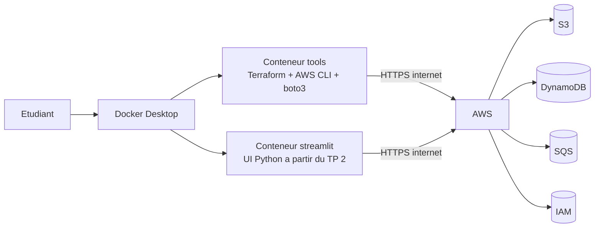
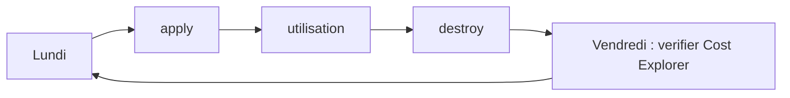

<a id="top"></a>

# 00 — Théorie : Terraform sur un vrai compte AWS Free Tier

> **Objectif de ce document :** poser le cadre théorique du cours, expliquer ce qui change par rapport à LocalStack, et donner les **règles d'hygiène financière** indispensables.

---

## Sommaire

1. [Différence fondamentale avec LocalStack](#diff)
2. [Architecture cible du cours](#archi)
3. [Le compte AWS et l'IAM user dédié](#compte)
4. [Détail du Free Tier](#free)
5. [Les ressources `AWS` utilisées dans le cours](#ressources)
6. [Les ressources à éviter (hors Free Tier)](#eviter)
7. [Discipline de coût : 4 règles d'or](#discipline)
8. [Stratégie de nommage et tags](#nommage)
9. [Gestion des secrets et fichier `.env`](#secrets)
10. [Quoi faire en cas de facture surprise](#facture)
11. [Glossaire](#glossaire)
12. [Références](#references)

---

<a id="diff"></a>

## 1. Différence fondamentale avec LocalStack

| Aspect | LocalStack | AWS réel (ce cours) |
|---|---|---|
| Endpoint | `http://localstack:4566` | endpoints AWS publics (`*.amazonaws.com`) |
| Credentials | `AWS_ACCESS_KEY_ID=test` | clé d'accès **réelle** d'un IAM user |
| Coût | gratuit | **payant si on dépasse le Free Tier** |
| IAM enforcement | mocké | **réel** (les `Deny` bloquent) |
| Filtrage réseau | aucun | réel |
| Services managés complets (CloudTrail, GuardDuty…) | partiel ou absent | tous disponibles (souvent payants) |
| Persistance | tant que le conteneur tourne | persistant tant que la ressource existe |
| Réseau Internet sortant | non requis | **requis** |

> **Conséquence pratique :** une ligne de code Terraform mal écrite a maintenant un **impact économique réel**. Le `terraform destroy` n'est plus une habitude, c'est une **obligation**.

---

<a id="archi"></a>

## 2. Architecture cible du cours



- Aucun outil sur l'hôte sauf Docker Desktop.
- Les conteneurs reçoivent `AWS_ACCESS_KEY_ID`, `AWS_SECRET_ACCESS_KEY`, `AWS_DEFAULT_REGION` via `.env`.
- Terraform et `boto3` parlent en HTTPS aux APIs AWS officielles.

---

<a id="compte"></a>

## 3. Le compte AWS et l'IAM user dédié

### 3.1. Pourquoi ne pas utiliser le root

Le compte **root** est celui que vous avez utilisé pour vous inscrire chez AWS. Il a **tous les droits**, incluant la fermeture du compte et la modification des moyens de paiement. **Vous ne devez plus l'utiliser** sauf pour les opérations administratives ponctuelles (changer le moyen de paiement, support).

### 3.2. Créer un IAM user `terraform-student`

| Étape | Action |
|---|---|
| 1 | Console AWS → IAM → **Users** → **Create user** |
| 2 | Nom : `terraform-student`, **sans accès console** |
| 3 | **Attach policies directly** → `AdministratorAccess` (pour le cours uniquement) |
| 4 | Créer le user |
| 5 | Onglet **Security credentials** → **Create access key** → **Application running outside AWS** |
| 6 | Copier `Access key ID` et `Secret access key` dans un endroit sûr |

### 3.3. Activer la MFA du compte root

Console → **My Security Credentials** → **Multi-factor authentication** → enregistrer une application authenticator (Google Authenticator, Authy, 1Password…). Ne plus jamais s'y connecter sans MFA.

### 3.4. Activer une alerte de budget

Console → **Billing** → **Budgets** → **Create budget** :

- Type : **Cost budget**
- Période : mensuelle
- Montant : **5 USD**
- Alerte à 80 % par email

> **Pourquoi 5 USD ?** Le cours doit rester gratuit. Si vous atteignez 5 USD, c'est que quelque chose tourne et n'est pas détruit. Allez vérifier immédiatement.

---

<a id="free"></a>

## 4. Détail du Free Tier

Le Free Tier AWS a **trois catégories** :

1. **Always Free** : gratuit pour toujours, dans des limites mensuelles (ex. DynamoDB 25 Go, SQS 1 M requêtes, Lambda 1 M requêtes).
2. **12 months Free** : gratuit pendant 12 mois à partir de la création du compte (ex. S3 5 Go, EC2 750 h `t2.micro`, RDS 750 h `db.t2.micro`).
3. **Free Trials** : essais courte durée pour certains services.

Le cours utilise **uniquement les catégories 1 et 2**, et reste dans des volumes très inférieurs aux limites.

| Service | Type | Limite mensuelle Free Tier |
|---|---|---|
| S3 | 12 mois | 5 Go stockage, 20 000 GET, 2 000 PUT |
| DynamoDB | Always Free | 25 Go stockage, 25 unités R/W On-Demand |
| SQS | Always Free | 1 000 000 requêtes |
| IAM | Always Free | gratuit |
| CloudWatch Logs | Always Free | 5 Go ingestion + 5 Go stockage |
| Data Transfer Out | Always Free | 100 Go / mois (depuis Internet → AWS gratuit toujours) |

> **Source officielle :** https://aws.amazon.com/free/

---

<a id="ressources"></a>

## 5. Les ressources AWS utilisées dans le cours

| TP | Ressources |
|---:|---|
| TP 1 | `aws_s3_bucket`, `aws_s3_bucket_versioning`, `aws_s3_bucket_public_access_block`, `aws_s3_bucket_server_side_encryption_configuration`, `aws_dynamodb_table` (PAY_PER_REQUEST) |
| TP 2 | tout du TP 1 + UI Streamlit qui lit/écrit via boto3 |
| TP 3 | tout du TP 2 + `aws_sqs_queue` standard |
| TP 4 | refactor en modules Terraform |
| TP 5 | environnements `dev` / `test` avec `.tfvars` |

Toutes ces ressources sont **gratuites dans les volumes utilisés**.

---

<a id="eviter"></a>

## 6. Les ressources à éviter (hors Free Tier)

> **ARGENT :** ne pas créer ces ressources sans en mesurer le coût.

| Ressource | Pourquoi |
|---|---|
| **NAT Gateway** | ~0.045 USD/h + transfert de données |
| **Elastic IP non attachée** | ~0.005 USD/h |
| **VPC endpoint Interface** | ~0.01 USD/h par AZ |
| **DynamoDB `PROVISIONED` avec forte capacité** | au-delà des 25 unités, payant |
| **RDS hors `t2.micro` / `t3.micro`** | facturé |
| **CloudFront, Route 53, Lambda@Edge** | facturés rapidement |
| **GuardDuty, Security Hub, AWS Config** | facturés (parfois 1-2 USD le premier jour) |
| **Aurora Serverless** | facturé |

---

<a id="discipline"></a>

## 7. Discipline de coût : 4 règles d'or

### Règle 1 — `terraform destroy` en fin de session

```bash
docker compose run --rm tools terraform -chdir=terraform destroy -auto-approve
```

### Règle 2 — Tagger toutes les ressources

```hcl
tags = {
  Project     = "tp1"
  Environment = "dev"
  Owner       = "alice"
  ManagedBy   = "terraform"
}
```

### Règle 3 — Alerte de budget à 5 USD

Activée une fois (voir [section 3.4](#compte)).

### Règle 4 — Vérification hebdomadaire

Console AWS → **Billing** → **Cost Explorer** → vérifier qu'il n'y a pas de service inattendu.



---

<a id="nommage"></a>

## 8. Stratégie de nommage et tags

### Préfixe global

Pour éviter les conflits (les noms de bucket S3 sont **globaux**), utilisez un préfixe propre à vous :

```
tfaws-<prenom>-<usage>
```

Exemples :

- `tfaws-alice-data-bucket-7g3k`
- `tfaws-alice-tp3-queue`
- `tfaws-alice-state-table`

### Tags obligatoires sur **toutes** les ressources

| Tag | Exemple |
|---|---|
| `Project` | `tp1`, `tp2`, … |
| `Environment` | `dev` ou `test` |
| `Owner` | `alice` |
| `ManagedBy` | `terraform` |

> **Pourquoi ?** En cas de coût inattendu, vous filtrez les coûts par tag dans Cost Explorer et identifiez la source en 1 minute.

---

<a id="secrets"></a>

## 9. Gestion des secrets et fichier `.env`

| Fichier | Contenu | Sous Git ? |
|---|---|---|
| `.env.example` | placeholders (`AWS_ACCESS_KEY_ID=YOUR_KEY_HERE`) | OUI |
| `.env` | **vraies clés** | **NON** (dans `.gitignore`) |

Modèle de `.env` :

```env
AWS_ACCESS_KEY_ID=AKIA...
AWS_SECRET_ACCESS_KEY=...
AWS_DEFAULT_REGION=us-east-1
AWS_REGION=us-east-1
PROJECT_PREFIX=tfaws-alice
```

> **Attention :** ne jamais committer une vraie clé d'accès dans Git. Si cela arrive : **désactiver immédiatement la clé** dans IAM, et en créer une nouvelle.

> **Vérification rapide :**
>
> ```bash
> git status            # .env doit etre 'ignored', pas 'untracked'
> git check-ignore .env # doit afficher .env
> ```

---

<a id="facture"></a>

## 10. Quoi faire en cas de facture surprise

1. **Identifier le service** dans Cost Explorer (groupement par service, par tag).
2. **Détruire les ressources** : `terraform destroy` puis vérifier dans la console.
3. **Si la facture vous semble injustifiée** : contacter le **support AWS** (gratuit pour les questions de facturation, même en plan Basic) avec une explication détaillée. AWS rembourse régulièrement les premiers dépassements pédagogiques.
4. **Mettre à jour l'alerte** de budget pour éviter le prochain incident.

---

<a id="glossaire"></a>

## 11. Glossaire

- **Free Tier** : niveau gratuit AWS, sous conditions et plafonds.
- **IAM user** : identité humaine ou applicative dans AWS.
- **Root account** : compte de création, à n'utiliser qu'en cas extrême.
- **MFA** : Multi-Factor Authentication.
- **Tag** : paire clé/valeur attachée à une ressource AWS.
- **`terraform destroy`** : commande qui supprime toutes les ressources gérées par le state Terraform.
- **`AWS_DEFAULT_REGION`** : variable d'environnement utilisée par AWS CLI et boto3.
- **Bucket policy** : policy attachée à un bucket S3.

---

<a id="references"></a>

## 12. Références

- AWS — Free Tier : https://aws.amazon.com/free/
- AWS — Budgets : https://docs.aws.amazon.com/cost-management/latest/userguide/budgets-managing-costs.html
- AWS — Cost Explorer : https://docs.aws.amazon.com/cost-management/latest/userguide/ce-what-is.html
- AWS — IAM Best Practices : https://docs.aws.amazon.com/IAM/latest/UserGuide/best-practices.html
- AWS — Pricing Calculator : https://calculator.aws/
- HashiCorp — Terraform AWS Provider : https://registry.terraform.io/providers/hashicorp/aws/latest/docs

<p align="right"><a href="#top">↑ Retour en haut</a></p>
