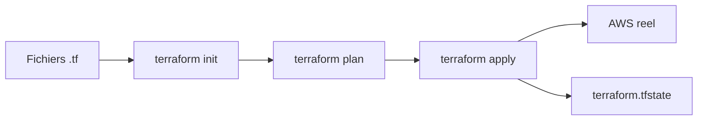

# Chapitre 1 — Théorie : premier projet Terraform sur AWS

> **Objectif :** comprendre comment Terraform parle à AWS, le rôle de chaque fichier et ce qu'on va déployer dans le TP 1.

---

## Sommaire

1. [Rappel : qu'est-ce que Terraform ?](#terraform)
2. [Comment Terraform parle à AWS](#auth)
3. [Les fichiers d'un projet Terraform](#fichiers)
4. [Le cycle de vie : init / plan / apply / destroy](#cycle)
5. [Les ressources S3 et DynamoDB du TP 1](#tp1)
6. [Le state Terraform](#state)
7. [Différences clés vs LocalStack](#diff)
8. [Quiz](#quiz)
9. [Références](#references)

---

<a id="terraform"></a>

## 1. Rappel : qu'est-ce que Terraform ?

Terraform est un outil **d'Infrastructure as Code (IaC)** développé par HashiCorp. Vous décrivez l'infrastructure cible dans des fichiers `.tf` (langage HCL), et Terraform :

- **calcule** ce qu'il faut créer, modifier ou supprimer,
- **applique** les changements via les APIs du provider (ici AWS),
- **enregistre** l'état dans un fichier `terraform.tfstate`.



---

<a id="auth"></a>

## 2. Comment Terraform parle à AWS

Le provider AWS de Terraform utilise la **chaîne d'authentification standard** :

1. Variables d'environnement `AWS_ACCESS_KEY_ID`, `AWS_SECRET_ACCESS_KEY`, `AWS_DEFAULT_REGION`,
2. Sinon : fichier `~/.aws/credentials`,
3. Sinon : metadata d'instance (EC2 / ECS),
4. Sinon : SSO, etc.

Dans ce cours, on utilise **uniquement les variables d'environnement**, injectées par Docker Compose depuis `.env`.

```hcl
provider "aws" {
  region = var.region
}
```

> **Pourquoi pas mettre la clé dans le `.tf` ?** Parce qu'on le commit dans Git. **Jamais de secret dans le code**.

---

<a id="fichiers"></a>

## 3. Les fichiers d'un projet Terraform

| Fichier | Rôle |
|---|---|
| `provider.tf` | Déclare les providers (ex. `aws`), versions, configuration globale. |
| `variables.tf` | Variables d'entrée (région, préfixe, suffixe…). |
| `main.tf` | Déclarations des ressources. |
| `outputs.tf` | Valeurs exposées en sortie (`terraform output`). |
| `terraform.tfstate` | État actuel — **généré**, jamais édité à la main, jamais committé. |
| `.terraform/` | Cache des modules et plugins — **généré**. |
| `.terraform.lock.hcl` | Verrouille les versions de providers. Souvent committé. |

Conventions du cours : on sépare en 4 fichiers `.tf` pour la lisibilité.

---

<a id="cycle"></a>

## 4. Le cycle de vie : init / plan / apply / destroy

| Commande | Effet |
|---|---|
| `terraform init` | Télécharge les providers, initialise le backend. |
| `terraform plan` | Affiche ce qui va être créé / modifié / supprimé. **Ne fait rien sur AWS.** |
| `terraform apply` | Applique le plan. **Crée vraiment** sur AWS. |
| `terraform destroy` | Supprime toutes les ressources gérées par le state. **Coût retombe à 0**. |
| `terraform output` | Affiche les outputs (ARNs, noms…). |
| `terraform state list` | Liste les ressources connues du state. |

> **Astuce :** toujours lancer `plan` avant `apply` pour vérifier que vous n'allez pas créer 200 ressources accidentellement.

---

<a id="tp1"></a>

## 5. Les ressources S3 et DynamoDB du TP 1

### S3 (Simple Storage Service)

| Concept | Sens |
|---|---|
| Bucket | conteneur de niveau supérieur (nom global et unique). |
| Object | fichier dans le bucket. |
| Versioning | conserve les anciennes versions d'un objet. |
| SSE-S3 | chiffrement at-rest, clé gérée par S3. |
| Public access block | les 4 cases qui bloquent toute exposition publique. |

> **Free Tier :** 5 Go de stockage, 20 000 GET, 2 000 PUT par mois pendant 12 mois.

### DynamoDB

| Concept | Sens |
|---|---|
| Table | structure NoSQL clé-valeur. |
| Partition key (hash key) | clé primaire principale. |
| Sort key | clé secondaire optionnelle. |
| Mode `PAY_PER_REQUEST` (On-Demand) | payez par requête, pas de capacité provisionnée. |
| Mode `PROVISIONED` | capacité fixe en RCU/WCU. |

> **Free Tier :** 25 Go de stockage + 25 RCU/WCU en On-Demand toujours gratuits.

Choix du cours : **toujours `PAY_PER_REQUEST`** pour éviter tout coût en cas d'oubli.

---

<a id="state"></a>

## 6. Le state Terraform

### Qu'est-ce que c'est ?

Un fichier JSON (`terraform.tfstate`) qui mémorise la **correspondance** entre les ressources déclarées dans le code et les **ressources réelles** sur AWS.

### Où le stocker ?

| Mode | Quand | Recommandation |
|---|---|---|
| Local | un développeur seul | OK pour ce cours |
| Remote (S3 + DynamoDB lock) | équipe ou production | indispensable en entreprise |

Dans ce cours, on reste **en local** pour la simplicité. En entreprise, on stocke le state dans S3 avec **verrouillage** DynamoDB.

> **Important :** ne **jamais committer** `*.tfstate` (peut contenir des secrets).

---

<a id="diff"></a>

## 7. Différences clés vs LocalStack

| Aspect | LocalStack | AWS réel |
|---|---|---|
| `provider "aws"` | bloc `endpoints { ... }` | **rien** : endpoints AWS publics par défaut |
| Credentials | `test` / `test` | vraies clés IAM |
| `s3_use_path_style` | `true` | **`false`** (par défaut) |
| Coût | gratuit | facturable hors Free Tier |

Concrètement, le provider AWS pour ce cours est **plus simple** :

```hcl
provider "aws" {
  region = var.region
}
```

Pas d'endpoint, pas de `s3_use_path_style`, pas de `skip_credentials_validation`. C'est plus court parce qu'on parle directement à AWS.

---

<a id="quiz"></a>

## 8. Quiz

1. Quelle commande affiche ce qui va être créé sans rien créer ?
2. Pourquoi mettre les clés AWS dans `.env` plutôt que dans le code `.tf` ?
3. Quel mode de facturation DynamoDB choisit-on dans ce cours ?
4. Quelle est la taille du Free Tier S3 ?
5. Quelle commande supprime toutes les ressources gérées par Terraform ?

> Réponses : 1. `terraform plan`. 2. Pour ne pas committer de secret. 3. `PAY_PER_REQUEST`. 4. 5 Go. 5. `terraform destroy`.

---

<a id="references"></a>

## 9. Références

- Terraform — Provider AWS : https://registry.terraform.io/providers/hashicorp/aws/latest/docs
- AWS — S3 : https://docs.aws.amazon.com/AmazonS3/
- AWS — DynamoDB : https://docs.aws.amazon.com/dynamodb/
- AWS Free Tier : https://aws.amazon.com/free/

---

➡ Pratique : [`01b-Chapitre1-Pratique-premier-projet-terraform-s3-dynamodb.md`](01b-Chapitre1-Pratique-premier-projet-terraform-s3-dynamodb.md)
