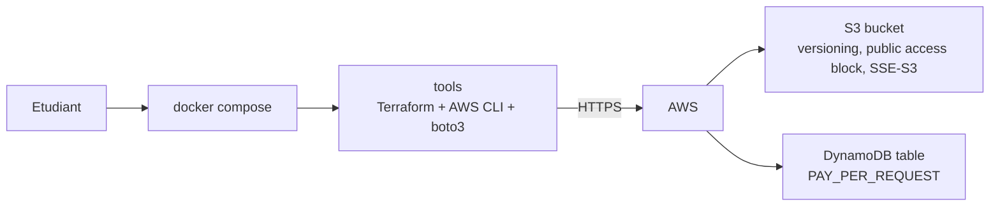

<a id="top"></a>

# Chapitre 1 — Pratique : premier projet Terraform sur AWS réel (S3 + DynamoDB)

> **Module :** M1 — Premier projet sur AWS.
>
> **Théorie associée :** [`01a-Chapitre1-Theorie-premier-projet-terraform.md`](01a-Chapitre1-Theorie-premier-projet-terraform.md)
>
> **Solution exécutable :** [`solutions/tp1b/`](solutions/tp1b/)
>
> **Durée estimée :** 90 minutes.

---

> **ARGENT :** ce TP crée de **vraies ressources** sur votre compte AWS. Les services utilisés (S3, DynamoDB On-Demand) sont **Free Tier**. La dépense reste à 0 USD **si** vous lancez `terraform destroy` en fin de session.

---

## Sommaire

- [Objectifs](#objectifs)
- [Prérequis](#prerequis)
- [Architecture cible](#archi)
- [Plan du TP (parties I à XV)](#plan)
- [Partie I — Préparer le compte AWS et l'IAM user](#part1)
- [Partie II — Préparer Docker et le `.env`](#part2)
- [Partie III — Vérifier l'authentification](#part3)
- [Partie IV — Squelette Terraform et provider](#part4)
- [Partie V — Variables et tags](#part5)
- [Partie VI — Suffixe aléatoire pour le bucket](#part6)
- [Partie VII — Le bucket S3](#part7)
- [Partie VIII — Versioning + Public Access Block + SSE](#part8)
- [Partie IX — La table DynamoDB](#part9)
- [Partie X — Outputs](#part10)
- [Partie XI — `init`, `plan`, `apply`](#part11)
- [Partie XII — Validations CLI](#part12)
- [Partie XIII — Mini-rapport](#part13)
- [Partie XIV — Nettoyage et vérification dans la console](#part14)
- [Partie XV — Vérifier la facturation](#part15)
- [Barème](#bareme)
- [Corrigé minimal](#corrige)
- [Références](#references)

---

<a id="objectifs"></a>

## Objectifs

À la fin de ce TP, vous saurez :

- créer un **IAM user dédié** Terraform avec une clé d'accès,
- configurer Docker Compose pour passer vos credentials AWS,
- écrire un projet Terraform minimal qui crée **S3** et **DynamoDB**,
- valider via AWS CLI et la console,
- **détruire** proprement et vérifier qu'il ne reste rien.

---

<a id="prerequis"></a>

## Prérequis

- Compte AWS actif avec **MFA root** activé.
- **IAM user `terraform-student`** créé (cf. [`README.md`](README.md) section 5).
- **Alerte de budget** 5 USD activée.
- Docker Desktop démarré.

---

<a id="archi"></a>

## Architecture cible



---

<a id="plan"></a>

## Plan du TP (parties I à XV)

| Partie | Sujet |
|---:|---|
| I | IAM user + clés |
| II | Docker + `.env` |
| III | `aws sts get-caller-identity` |
| IV | provider.tf |
| V | variables.tf + tags |
| VI | suffixe `random_id` |
| VII | bucket S3 |
| VIII | versioning + block + SSE |
| IX | DynamoDB |
| X | outputs |
| XI | init / plan / apply |
| XII | validations CLI |
| XIII | mini-rapport |
| XIV | destroy |
| XV | facturation |

---

<a id="part1"></a>

## Partie I — Préparer le compte AWS et l'IAM user

> **Objectif :** disposer d'une **clé d'accès** appartenant à un user non-root.

1. Connexion console AWS avec votre compte.
2. **IAM** → **Users** → **Create user** → `terraform-student`.
3. **Attach policies directly** → cocher `AdministratorAccess` (pédagogique uniquement).
4. Sélectionner le user → **Security credentials** → **Create access key** → **Application running outside AWS** → noter `AKIA...` et la clé secrète.

> **Attention :** ne **jamais** committer ces clés dans Git. Elles iront uniquement dans `.env` qui est dans `.gitignore`.

---

<a id="part2"></a>

## Partie II — Préparer Docker et le `.env`

```bash
cd terraform-aws-free-tier/solutions/tp1b
cp .env.example .env
```

Éditer `.env` :

```env
AWS_ACCESS_KEY_ID=AKIA...
AWS_SECRET_ACCESS_KEY=...
AWS_DEFAULT_REGION=us-east-1
AWS_REGION=us-east-1
PROJECT_PREFIX=tfaws-alice
```

> **Astuce :** remplacez `alice` par votre prénom pour rendre les noms uniques.

```bash
docker compose build
docker compose up -d tools
```

---

<a id="part3"></a>

## Partie III — Vérifier l'authentification

```bash
docker compose run --rm tools aws sts get-caller-identity
```

Sortie attendue :

```json
{
    "UserId": "AIDA...",
    "Account": "123456789012",
    "Arn": "arn:aws:iam::123456789012:user/terraform-student"
}
```

> **Attention :** si la sortie contient `arn:aws:iam::...:root`, **vous utilisez le root** — STOP, refaites la partie I.

---

<a id="part4"></a>

## Partie IV — Squelette Terraform et provider

`terraform/provider.tf` :

```hcl
terraform {
  required_version = ">= 1.6.0"
  required_providers {
    aws    = { source = "hashicorp/aws",    version = "~> 5.0" }
    random = { source = "hashicorp/random", version = "~> 3.6" }
  }
}

provider "aws" {
  region = var.region
}
```

> **Pourquoi pas d'`endpoints { ... }` ?** Parce qu'on parle au **vrai AWS**, pas à LocalStack.

---

<a id="part5"></a>

## Partie V — Variables et tags

`terraform/variables.tf` :

```hcl
variable "region"         { type = string,  default = "us-east-1" }
variable "project_prefix" { type = string,  default = "tfaws-student" }
variable "environment"    { type = string,  default = "dev" }
variable "owner"          { type = string,  default = "student" }
```

Tags communs dans `main.tf` :

```hcl
locals {
  common_tags = {
    Project     = "tp1"
    Environment = var.environment
    Owner       = var.owner
    ManagedBy   = "terraform"
  }
}
```

> **Pourquoi des tags partout ?** Cost Explorer permet de filtrer le coût par tag. Sans tag, vous ne saurez pas qui a généré quoi.

---

<a id="part6"></a>

## Partie VI — Suffixe aléatoire pour le bucket

```hcl
resource "random_id" "suffix" {
  byte_length = 3
}
```

Cela génère par exemple `a3f17b`. On l'ajoutera au nom du bucket pour garantir l'unicité globale.

---

<a id="part7"></a>

## Partie VII — Le bucket S3

```hcl
resource "aws_s3_bucket" "data" {
  bucket = "${var.project_prefix}-tp1-data-${random_id.suffix.hex}"
  tags   = local.common_tags
}
```

> **Attention :** le nom S3 est **global**. Si vous voyez `BucketAlreadyExists`, c'est qu'un autre étudiant utilise le même `PROJECT_PREFIX`. Changez votre préfixe.

---

<a id="part8"></a>

## Partie VIII — Versioning + Public Access Block + SSE

```hcl
resource "aws_s3_bucket_versioning" "data" {
  bucket = aws_s3_bucket.data.id
  versioning_configuration { status = "Enabled" }
}

resource "aws_s3_bucket_public_access_block" "data" {
  bucket                  = aws_s3_bucket.data.id
  block_public_acls       = true
  block_public_policy     = true
  ignore_public_acls      = true
  restrict_public_buckets = true
}

resource "aws_s3_bucket_server_side_encryption_configuration" "data" {
  bucket = aws_s3_bucket.data.id
  rule {
    apply_server_side_encryption_by_default { sse_algorithm = "AES256" }
  }
}
```

> **Pourquoi les 3 ?** Hygiène minimale d'un bucket en production. Aucun coût supplémentaire.

---

<a id="part9"></a>

## Partie IX — La table DynamoDB

```hcl
resource "aws_dynamodb_table" "items" {
  name         = "${var.project_prefix}-tp1-items"
  billing_mode = "PAY_PER_REQUEST"
  hash_key     = "pk"

  attribute {
    name = "pk"
    type = "S"
  }

  tags = local.common_tags
}
```

> **Pourquoi `PAY_PER_REQUEST` ?** Mode On-Demand : vous ne payez que ce que vous utilisez. **Toujours dans le Free Tier** pour un usage pédagogique.

---

<a id="part10"></a>

## Partie X — Outputs

```hcl
output "data_bucket_name"  { value = aws_s3_bucket.data.bucket }
output "items_table_name"  { value = aws_dynamodb_table.items.name }
```

---

<a id="part11"></a>

## Partie XI — `init`, `plan`, `apply`

```bash
docker compose run --rm tools terraform -chdir=terraform init
docker compose run --rm tools terraform -chdir=terraform plan
docker compose run --rm tools terraform -chdir=terraform apply -auto-approve
```

> **Attention :** lisez bien la sortie du `plan` avant `apply`. Si le plan veut créer 50 ressources, vous avez un problème.

---

<a id="part12"></a>

## Partie XII — Validations CLI

```bash
docker compose run --rm tools terraform -chdir=terraform output

docker compose run --rm tools aws s3 ls
docker compose run --rm tools aws s3api get-bucket-versioning --bucket $(docker compose run --rm tools terraform -chdir=terraform output -raw data_bucket_name)
docker compose run --rm tools aws s3api get-public-access-block --bucket $(docker compose run --rm tools terraform -chdir=terraform output -raw data_bucket_name)
docker compose run --rm tools aws s3api get-bucket-encryption --bucket $(docker compose run --rm tools terraform -chdir=terraform output -raw data_bucket_name)

docker compose run --rm tools aws dynamodb list-tables
docker compose run --rm tools aws dynamodb describe-table --table-name $(docker compose run --rm tools terraform -chdir=terraform output -raw items_table_name) | jq '.Table | { name: .TableName, status: .TableStatus, billing: .BillingModeSummary }'
```

---

<a id="part13"></a>

## Partie XIII — Mini-rapport

1. Quelle commande Terraform consultez-vous avant `apply` ?
2. Pourquoi un suffixe aléatoire sur le bucket ?
3. Que se passe-t-il si vous oubliez `terraform destroy` pendant une semaine ?
4. Pourquoi `PAY_PER_REQUEST` plutôt que `PROVISIONED` ?
5. Capture d'écran : la console AWS S3 montrant votre bucket.

---

<a id="part14"></a>

## Partie XIV — Nettoyage et vérification dans la console

```bash
docker compose run --rm tools terraform -chdir=terraform destroy -auto-approve
```

Puis ouvrir :

- https://s3.console.aws.amazon.com/ — votre bucket doit avoir disparu.
- https://us-east-1.console.aws.amazon.com/dynamodbv2/ — votre table doit avoir disparu.

```bash
docker compose down
```

---

<a id="part15"></a>

## Partie XV — Vérifier la facturation

- Console → **Billing** → **Bills** : la ligne du jour doit être à **0 USD** sur ces services.
- Si elle ne l'est pas, vérifiez Cost Explorer pour identifier la source.

---

<a id="bareme"></a>

## Barème (40 points)

| Partie | Points |
|---:|---:|
| I — IAM user | 3 |
| II — Docker + .env | 3 |
| III — sts identity | 2 |
| IV — provider | 3 |
| V — variables + tags | 4 |
| VI — random suffix | 2 |
| VII — bucket | 4 |
| VIII — versioning + block + SSE | 6 |
| IX — DynamoDB | 5 |
| X — outputs | 2 |
| XI — apply | 2 |
| XII — validations CLI | 2 |
| XIII — mini-rapport | 1 |
| XIV — destroy + console | 1 |
| **Total** | **40** |

---

<a id="corrige"></a>

## Corrigé minimal

Voir [`solutions/tp1b/`](solutions/tp1b/).

---

<a id="references"></a>

## Références

- Terraform — Provider AWS : https://registry.terraform.io/providers/hashicorp/aws/latest/docs
- AWS — Free Tier : https://aws.amazon.com/free/
- AWS — S3 best practices : https://docs.aws.amazon.com/AmazonS3/latest/userguide/security-best-practices.html
- AWS — DynamoDB billing : https://aws.amazon.com/dynamodb/pricing/

---

⬅ [`01a-...md`](01a-Chapitre1-Theorie-premier-projet-terraform.md) | 🏠 [`README.md`](README.md) | ➡ [`02a-...md`](02a-Chapitre2-Theorie-streamlit-validation.md)

<p align="right"><a href="#top">↑ Retour en haut</a></p>
