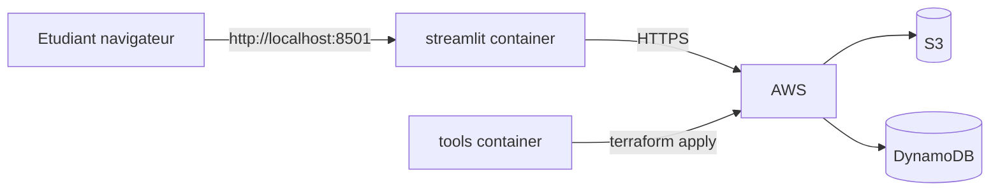

# Chapitre 2 — Théorie : valider Terraform avec une UI Streamlit

> **Objectif :** comprendre pourquoi on construit une UI Streamlit pour interagir avec les ressources AWS, et comment `boto3` se branche sur les services réels.

---

## Sommaire

1. [Pourquoi une UI Streamlit ?](#pourquoi)
2. [Architecture du TP 2](#archi)
3. [`boto3` côté réel vs côté LocalStack](#boto3)
4. [Conteneur `streamlit` dédié](#streamlit)
5. [Bonnes pratiques](#bonnes-pratiques)
6. [Quiz](#quiz)
7. [Références](#references)

---

<a id="pourquoi"></a>

## 1. Pourquoi une UI Streamlit ?

Avec `terraform apply`, on **crée** les ressources, mais on n'a pas de **preuve visuelle** que tout fonctionne. Quelques options possibles :

| Option | Avantages | Inconvénients |
|---|---|---|
| Console AWS | UI officielle complète | dépend du navigateur, lent à recharger |
| AWS CLI | rapide, scriptable | terminal seulement |
| Streamlit local | visuelle, interactive, pédagogique | nécessite un peu de code Python |

Pour ce cours, **Streamlit** est :

- **idéal pour démontrer** (capture d'écran de l'UI = livrable concret),
- en **Python**, langage probablement déjà connu de l'étudiant,
- **léger** (un seul script Python, un seul port).

---

<a id="archi"></a>

## 2. Architecture du TP 2



- Le conteneur `streamlit` expose le port `8501`.
- Il monte le dossier `./streamlit_app` et `./lib`.
- Il reçoit les **mêmes credentials** que `tools` via `.env`.

---

<a id="boto3"></a>

## 3. `boto3` côté réel vs côté LocalStack

| LocalStack | AWS réel |
|---|---|
| `boto3.client("s3", endpoint_url="http://localstack:4566")` | `boto3.client("s3")` |
| Path-style addressing | Virtual-hosted-style (par défaut) |
| Credentials `test`/`test` | vraies clés IAM |

Le code Python est **plus court** quand on tape AWS réel : on n'a pas besoin de passer un `endpoint_url`.

```python
import boto3

s3 = boto3.client("s3")
ddb = boto3.resource("dynamodb")
```

`boto3` lit les variables d'environnement `AWS_ACCESS_KEY_ID`, `AWS_SECRET_ACCESS_KEY`, `AWS_DEFAULT_REGION` automatiquement.

---

<a id="streamlit"></a>

## 4. Conteneur `streamlit` dédié

| Aspect | Détail |
|---|---|
| Image | `python:3.11-slim` |
| Installé | `streamlit`, `boto3` |
| Port exposé | `8501` |
| Volume | code source `./streamlit_app/` |
| Variables d'env | héritées de `.env` |

**Pourquoi un conteneur séparé de `tools` ?** Pour pouvoir :

- redémarrer Streamlit sans toucher Terraform,
- exposer un seul port (`8501`) sans polluer `tools`,
- garder `tools` minimaliste (CLI only).

---

<a id="bonnes-pratiques"></a>

## 5. Bonnes pratiques

1. **Ne pas afficher de credentials** dans l'UI (`st.write(os.environ["AWS_SECRET_ACCESS_KEY"])` = mauvaise idée).
2. **Mettre en cache** les listes lourdes avec `@st.cache_data`.
3. **Gérer les exceptions** `botocore.exceptions.ClientError` pour afficher des messages clairs (`AccessDenied`, `NoSuchBucket`).
4. **Tagger toutes les opérations d'écriture** depuis l'UI (`Owner`, `Project`).
5. **Ne pas appeler `terraform apply` depuis Streamlit** : séparer infra (Terraform) et applicatif (Streamlit).

---

<a id="quiz"></a>

## 6. Quiz

1. Quel port expose Streamlit ?
2. Pourquoi séparer `tools` et `streamlit` en deux conteneurs ?
3. Comment `boto3` trouve-t-il les credentials AWS ?
4. Que met-on dans le conteneur Streamlit qu'on ne met **pas** dans `tools` ?
5. Quelle erreur affichera `boto3` si la région n'est pas définie ?

> Réponses : 1. 8501. 2. Cycle de vie indépendant + sécurité minimale. 3. Variables d'env, puis `~/.aws/credentials`, puis metadata. 4. `streamlit` lib. 5. `NoRegionError` ou `ValidationException`.

---

<a id="references"></a>

## 7. Références

- Streamlit : https://docs.streamlit.io/
- boto3 — Configuration : https://boto3.amazonaws.com/v1/documentation/api/latest/guide/configuration.html
- AWS — S3 boto3 examples : https://boto3.amazonaws.com/v1/documentation/api/latest/reference/services/s3.html

---

⬅ TP précédent : [`01b-Chapitre1-Pratique-premier-projet-terraform-s3-dynamodb.md`](01b-Chapitre1-Pratique-premier-projet-terraform-s3-dynamodb.md)  
➡ Pratique : [`02b-Chapitre2-Pratique-ajout-ui-streamlit.md`](02b-Chapitre2-Pratique-ajout-ui-streamlit.md)
