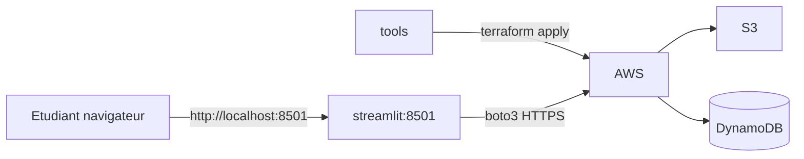

<a id="top"></a>

# Chapitre 2 — Pratique : ajouter une UI Streamlit pour valider Terraform

> **Module :** M2.
>
> **Théorie associée :** [`02a-Chapitre2-Theorie-streamlit-validation.md`](02a-Chapitre2-Theorie-streamlit-validation.md)
>
> **Solution exécutable :** [`solutions/tp2b/`](solutions/tp2b/)
>
> **Durée estimée :** 90 minutes.

---

> **ARGENT :** mêmes ressources que TP 1 (Free Tier). Streamlit tourne **dans Docker**, aucune ressource AWS supplémentaire.

---

## Sommaire

- [Objectifs](#objectifs)
- [Prérequis](#prerequis)
- [Architecture cible](#archi)
- [Plan du TP (parties I à XII)](#plan)
- [Partie I — Reprendre la base TP 1](#part1)
- [Partie II — Ajouter le service `streamlit`](#part2)
- [Partie III — Écrire `Dockerfile.streamlit`](#part3)
- [Partie IV — `lib/aws_clients.py`](#part4)
- [Partie V — `streamlit_app/app.py`](#part5)
- [Partie VI — Lancer `tools` et appliquer Terraform](#part6)
- [Partie VII — Lancer Streamlit](#part7)
- [Partie VIII — Tester les fonctionnalités](#part8)
- [Partie IX — Vérifier dans la console AWS](#part9)
- [Partie X — Mini-rapport](#part10)
- [Partie XI — Nettoyage](#part11)
- [Partie XII — Pour aller plus loin](#part12)
- [Barème](#bareme)
- [Corrigé minimal](#corrige)
- [Références](#references)

---

<a id="objectifs"></a>

## Objectifs

- ajouter un **conteneur Streamlit** au projet Terraform du TP 1,
- factoriser les clients boto3 dans `lib/aws_clients.py`,
- afficher l'identité AWS, lister les buckets, uploader un fichier, et écrire dans DynamoDB depuis l'UI.

---

<a id="prerequis"></a>

## Prérequis

- TP 1 réussi (`terraform destroy` exécuté à la fin).
- Docker Desktop démarré.
- `.env` rempli.

---

<a id="archi"></a>

## Architecture cible



---

<a id="plan"></a>

## Plan du TP (parties I à XII)

| Partie | Sujet |
|---:|---|
| I | Reprendre la base TP 1 |
| II | Ajouter `streamlit` au compose |
| III | `Dockerfile.streamlit` |
| IV | `lib/aws_clients.py` |
| V | `streamlit_app/app.py` |
| VI | apply Terraform |
| VII | lancer Streamlit |
| VIII | tests UI |
| IX | console AWS |
| X | mini-rapport |
| XI | destroy |
| XII | pour aller plus loin |

---

<a id="part1"></a>

## Partie I — Reprendre la base TP 1

Le `terraform/` du TP 2 est presque identique au TP 1, avec `Project = "tp2"` et un nom de bucket préfixé `tp2-`.

```bash
cd terraform-aws-free-tier/solutions/tp2b
cp .env.example .env
```

---

<a id="part2"></a>

## Partie II — Ajouter le service `streamlit`

`docker-compose.yml` :

```yaml
services:
  tools:
    build: { context: ., dockerfile: Dockerfile.tools }
    # ... idem TP 1 ...

  streamlit:
    build: { context: ., dockerfile: Dockerfile.streamlit }
    environment:
      - AWS_ACCESS_KEY_ID=${AWS_ACCESS_KEY_ID:?}
      - AWS_SECRET_ACCESS_KEY=${AWS_SECRET_ACCESS_KEY:?}
      - AWS_DEFAULT_REGION=${AWS_DEFAULT_REGION:-us-east-1}
      - AWS_REGION=${AWS_REGION:-us-east-1}
      - PROJECT_PREFIX=${PROJECT_PREFIX:-tfaws-student}
    volumes:
      - ./:/workspace
    ports:
      - "127.0.0.1:8501:8501"
```

> **Astuce :** binder sur `127.0.0.1` empêche l'UI d'être exposée sur le réseau local. Sécurité par défaut.

---

<a id="part3"></a>

## Partie III — Écrire `Dockerfile.streamlit`

```dockerfile
FROM python:3.11-slim
RUN pip install --no-cache-dir streamlit boto3
WORKDIR /workspace
EXPOSE 8501
CMD ["streamlit", "run", "streamlit_app/app.py", "--server.address=0.0.0.0", "--server.port=8501", "--server.headless=true"]
```

---

<a id="part4"></a>

## Partie IV — `lib/aws_clients.py`

Quelques helpers `boto3` :

```python
from functools import lru_cache
import boto3, os

@lru_cache(maxsize=1)
def s3_client():       return boto3.client("s3")
@lru_cache(maxsize=1)
def ddb_resource():    return boto3.resource("dynamodb")
@lru_cache(maxsize=1)
def sts_client():      return boto3.client("sts")
```

> **Pourquoi `lru_cache` ?** Boto3 a un coût d'initialisation. On crée un seul client par process.

---

<a id="part5"></a>

## Partie V — `streamlit_app/app.py`

Voir le fichier complet dans la solution. Sections clés :

1. Affichage de `get_caller_identity()`.
2. Liste des buckets préfixés.
3. Upload via `st.file_uploader` → `put_object`.
4. Formulaire DynamoDB → `put_item`.
5. Scan de la table → `st.table(items)`.

---

<a id="part6"></a>

## Partie VI — Lancer `tools` et appliquer Terraform

```bash
docker compose build
docker compose up -d tools

docker compose run --rm tools terraform -chdir=terraform init
docker compose run --rm tools terraform -chdir=terraform apply -auto-approve
```

---

<a id="part7"></a>

## Partie VII — Lancer Streamlit

```bash
docker compose up -d streamlit
docker compose logs -f streamlit
```

Ouvrir http://localhost:8501

> **Attention :** si vous voyez `Unable to locate credentials` dans Streamlit, vérifiez que `.env` est bien rempli et relancez `docker compose up -d streamlit`.

---

<a id="part8"></a>

## Partie VIII — Tester les fonctionnalités

1. Vérifier l'identité AWS dans l'UI : doit afficher `terraform-student`.
2. Lister les buckets : le bucket `tp2-data-...` doit apparaître.
3. Uploader un fichier `.txt`.
4. Ajouter un item dans la table DynamoDB avec une clé `item-1`.
5. Re-scanner la table : l'item doit apparaître.

---

<a id="part9"></a>

## Partie IX — Vérifier dans la console AWS

- https://s3.console.aws.amazon.com/ → ouvrir le bucket → le fichier est là.
- https://us-east-1.console.aws.amazon.com/dynamodbv2/ → table `tp2-items` → onglet **Items** → l'item est là.

---

<a id="part10"></a>

## Partie X — Mini-rapport

1. Pourquoi un conteneur Streamlit séparé de `tools` ?
2. Quel ARN affiche `get_caller_identity` quand vous êtes connecté en root ?
3. Pourquoi `lru_cache` sur les clients boto3 ?
4. Comment Streamlit récupère-t-il les credentials AWS ?
5. Que se passe-t-il si vous oubliez `terraform destroy` ?

---

<a id="part11"></a>

## Partie XI — Nettoyage

```bash
docker compose run --rm tools terraform -chdir=terraform destroy -auto-approve
docker compose down
```

---

<a id="part12"></a>

## Partie XII — Pour aller plus loin (optionnel)

- Ajouter une page Streamlit pour **lister la facturation** du jour (`ce:GetCostAndUsage`).
- Ajouter une page pour **lister les tags** des ressources.
- Ajouter un bouton **« Run terraform destroy »** (avec confirmation).

---

<a id="bareme"></a>

## Barème (40 points)

| Partie | Points |
|---:|---:|
| I — base TP 1 | 2 |
| II — compose | 4 |
| III — Dockerfile streamlit | 4 |
| IV — lib aws_clients | 4 |
| V — app.py | 10 |
| VI — apply | 3 |
| VII — Streamlit | 3 |
| VIII — tests UI | 6 |
| IX — console AWS | 2 |
| X — mini-rapport | 2 |
| **Total** | **40** |

---

<a id="corrige"></a>

## Corrigé minimal

Voir [`solutions/tp2b/`](solutions/tp2b/).

---

<a id="references"></a>

## Références

- Streamlit : https://docs.streamlit.io/
- boto3 — Configuration : https://boto3.amazonaws.com/v1/documentation/api/latest/guide/configuration.html
- AWS — STS get-caller-identity : https://docs.aws.amazon.com/STS/latest/APIReference/API_GetCallerIdentity.html

---

⬅ [`02a-...md`](02a-Chapitre2-Theorie-streamlit-validation.md) | 🏠 [`README.md`](README.md) | ➡ [`03a-...md`](03a-Chapitre3-Theorie-sqs.md)

<p align="right"><a href="#top">↑ Retour en haut</a></p>
