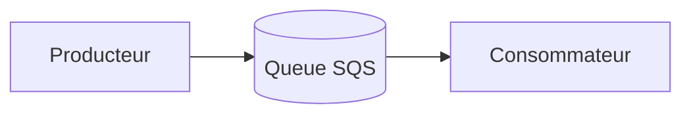
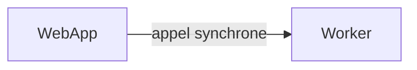
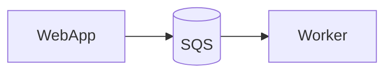
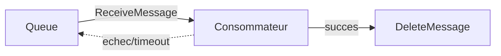
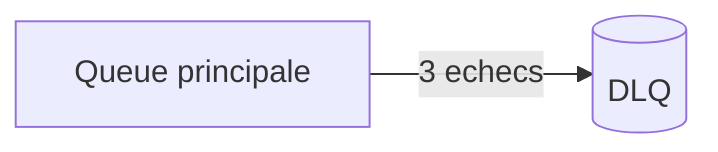

# Chapitre 3 — Théorie : Amazon SQS (Simple Queue Service)

> **Objectif :** comprendre le découplage par message, les deux types de queues SQS, le Free Tier SQS et son rôle dans une architecture moderne.

---

## Sommaire

1. [Qu'est-ce qu'une queue ?](#queue)
2. [Pourquoi découpler ?](#decoupler)
3. [SQS Standard vs FIFO](#standard-fifo)
4. [Vocabulaire SQS](#vocab)
5. [Visibility timeout et dead-letter queue](#vt-dlq)
6. [Limites et Free Tier](#free)
7. [Exemple boto3](#boto3)
8. [Quiz](#quiz)
9. [Références](#references)

---

<a id="queue"></a>

## 1. Qu'est-ce qu'une queue ?

Une **queue de messages** est une mémoire tampon entre un **producteur** (qui envoie) et un **consommateur** (qui lit).



Avantages :

- le producteur n'attend pas le consommateur,
- on absorbe les pics de charge,
- on découple les services.

---

<a id="decoupler"></a>

## 2. Pourquoi découpler ?

Sans queue :



Si le worker tombe, le web app **échoue**.

Avec une queue :



Si le worker tombe, **les messages s'accumulent** dans la queue. Le web app continue de répondre. Quand le worker remonte, il consomme la queue.

---

<a id="standard-fifo"></a>

## 3. SQS Standard vs FIFO

| Critère | Standard | FIFO |
|---|---|---|
| Ordre | best-effort, **pas garanti** | strictement préservé |
| Livraison | **at-least-once** (doublons possibles) | exactly-once (avec déduplication) |
| Débit | très élevé (illimité) | 300 messages/s par défaut |
| Suffixe nom | aucun | doit finir par `.fifo` |
| Coût | identique Free Tier | identique Free Tier |
| Usage typique | logs, jobs idempotents | virements bancaires, commandes |

Dans ce cours, **toujours SQS Standard** (suffisant, plus simple).

---

<a id="vocab"></a>

## 4. Vocabulaire SQS

| Terme | Sens |
|---|---|
| Message | un payload (texte ou JSON) jusqu'à 256 Ko |
| Producteur | code qui fait `SendMessage` |
| Consommateur | code qui fait `ReceiveMessage` + `DeleteMessage` |
| Visibility timeout | durée pendant laquelle un message lu est invisible aux autres consommateurs |
| Receipt handle | identifiant temporaire pour supprimer un message lu |
| DLQ | Dead Letter Queue, où vont les messages non traités |

---

<a id="vt-dlq"></a>

## 5. Visibility timeout et dead-letter queue

### Visibility timeout

Quand un consommateur fait `ReceiveMessage`, le message devient **invisible** pendant N secondes (30 s par défaut). Si le consommateur réussit, il appelle `DeleteMessage`. Sinon le message redevient visible et est relivré.



### Dead Letter Queue

Une **DLQ** est une autre queue où SQS déplace automatiquement les messages qui ont échoué N fois (paramètre `maxReceiveCount`).



DLQ optionnelle dans ce cours (peut être ajoutée en exercice bonus).

---

<a id="free"></a>

## 6. Limites et Free Tier

- **Free Tier SQS** : **1 000 000 requêtes par mois**, **toujours gratuit**. Une requête = `SendMessage`, `ReceiveMessage` (poll), `DeleteMessage`.
- **Long polling** (`WaitTimeSeconds=20`) consomme **moins de requêtes** que short polling, et c'est gratuit.
- Au-delà de 1 M requêtes : 0.40 USD par million.

> **Astuce :** dans ce cours, on reste loin de 1 M requêtes. Pas de souci de coût.

---

<a id="boto3"></a>

## 7. Exemple boto3

```python
import boto3, json

sqs = boto3.client("sqs")

queue_url = sqs.get_queue_url(QueueName="tfaws-alice-tp3-queue")["QueueUrl"]

# Envoyer
sqs.send_message(
    QueueUrl=queue_url,
    MessageBody=json.dumps({"event": "hello", "value": 42}),
)

# Lire
resp = sqs.receive_message(
    QueueUrl=queue_url,
    MaxNumberOfMessages=10,
    WaitTimeSeconds=20,         # long polling
)
for m in resp.get("Messages", []):
    print(m["Body"])
    sqs.delete_message(QueueUrl=queue_url, ReceiptHandle=m["ReceiptHandle"])
```

---

<a id="quiz"></a>

## 8. Quiz

1. Différence essentielle entre SQS **Standard** et **FIFO** ?
2. Que se passe-t-il si le consommateur oublie `DeleteMessage` ?
3. Quel est l'avantage du **long polling** sur le short polling ?
4. À quoi sert une **DLQ** ?
5. Quel est le quota Free Tier SQS ?

> Réponses : 1. Ordre garanti et exactly-once en FIFO, débit illimité en Standard. 2. Le message redevient visible et sera relivré. 3. Moins de requêtes pour le même résultat. 4. Stocker les messages qui ont échoué N fois. 5. 1 M de requêtes par mois.

---

<a id="references"></a>

## 9. Références

- AWS — SQS Developer Guide : https://docs.aws.amazon.com/AWSSimpleQueueService/latest/SQSDeveloperGuide/
- AWS — SQS Pricing : https://aws.amazon.com/sqs/pricing/
- boto3 — SQS : https://boto3.amazonaws.com/v1/documentation/api/latest/reference/services/sqs.html

---

⬅ TP précédent : [`02b-Chapitre2-Pratique-ajout-ui-streamlit.md`](02b-Chapitre2-Pratique-ajout-ui-streamlit.md)  
➡ Pratique : [`03b-Chapitre3-Pratique-ajouter-sqs.md`](03b-Chapitre3-Pratique-ajouter-sqs.md)
