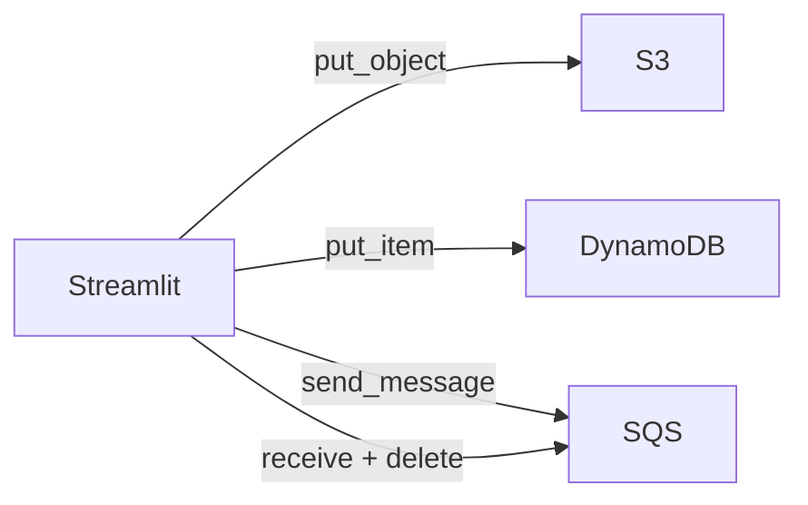

<a id="top"></a>

# Chapitre 3 — Pratique : ajouter SQS au projet

> **Module :** M3.
>
> **Théorie associée :** [`03a-Chapitre3-Theorie-sqs.md`](03a-Chapitre3-Theorie-sqs.md)
>
> **Solution exécutable :** [`solutions/tp3b/`](solutions/tp3b/)
>
> **Durée estimée :** 75 minutes.

---

> **ARGENT :** SQS Free Tier = 1 M requêtes/mois. Vous serez très loin du seuil. **`terraform destroy` à la fin.**

---

## Sommaire

- [Objectifs](#objectifs)
- [Architecture cible](#archi)
- [Plan du TP (parties I à XII)](#plan)
- [Partie I — Repartir du TP 2](#part1)
- [Partie II — Déclarer la queue SQS en Terraform](#part2)
- [Partie III — Outputs](#part3)
- [Partie IV — `apply` et vérifier la queue](#part4)
- [Partie V — Étendre `lib/aws_clients.py` avec SQS](#part5)
- [Partie VI — Ajouter la section SQS à `app.py`](#part6)
- [Partie VII — Envoyer et recevoir depuis l'UI](#part7)
- [Partie VIII — Tester via AWS CLI](#part8)
- [Partie IX — Vérifier la console AWS](#part9)
- [Partie X — Mini-rapport](#part10)
- [Partie XI — Nettoyage](#part11)
- [Partie XII — Pour aller plus loin](#part12)
- [Barème](#bareme)
- [Corrigé minimal](#corrige)
- [Références](#references)

---

<a id="objectifs"></a>

## Objectifs

- déclarer une **queue SQS Standard** avec **SSE** et **long polling**,
- étendre les helpers `boto3` (envoyer, recevoir, supprimer, attributs),
- ajouter une section SQS à l'UI Streamlit,
- tester via AWS CLI.

---

<a id="archi"></a>

## Architecture cible



---

<a id="plan"></a>

## Plan du TP (parties I à XII)

| Partie | Sujet |
|---:|---|
| I | Repartir du TP 2 |
| II | `aws_sqs_queue` |
| III | outputs |
| IV | apply |
| V | helpers SQS |
| VI | UI SQS |
| VII | tests UI |
| VIII | tests CLI |
| IX | console |
| X | mini-rapport |
| XI | destroy |
| XII | aller plus loin |

---

<a id="part1"></a>

## Partie I — Repartir du TP 2

```bash
cd terraform-aws-free-tier/solutions/tp3b
cp .env.example .env
```

---

<a id="part2"></a>

## Partie II — Déclarer la queue SQS en Terraform

```hcl
resource "aws_sqs_queue" "events" {
  name                       = "${var.project_prefix}-tp3-events"
  visibility_timeout_seconds = 30
  message_retention_seconds  = 86400  # 1 jour
  receive_wait_time_seconds  = 20     # long polling
  sqs_managed_sse_enabled    = true

  tags = local.common_tags
}
```

> **Pourquoi `receive_wait_time_seconds = 20` ?** Active le **long polling** par défaut. Moins de requêtes inutiles, plus économique, et meilleur temps de réponse.

> **Pourquoi `sqs_managed_sse_enabled = true` ?** Active le chiffrement at-rest avec une clé gérée par SQS. Gratuit.

---

<a id="part3"></a>

## Partie III — Outputs

```hcl
output "events_queue_name" { value = aws_sqs_queue.events.name }
output "events_queue_url"  { value = aws_sqs_queue.events.id }
output "events_queue_arn"  { value = aws_sqs_queue.events.arn }
```

---

<a id="part4"></a>

## Partie IV — `apply` et vérifier la queue

```bash
docker compose build
docker compose up -d tools
docker compose run --rm tools terraform -chdir=terraform init
docker compose run --rm tools terraform -chdir=terraform apply -auto-approve

docker compose run --rm tools aws sqs list-queues
```

---

<a id="part5"></a>

## Partie V — Étendre `lib/aws_clients.py` avec SQS

```python
@lru_cache(maxsize=1)
def sqs_client():
    return boto3.client("sqs")

def queue_url(name): return sqs_client().get_queue_url(QueueName=name)["QueueUrl"]

def send_message(name, body):
    return sqs_client().send_message(QueueUrl=queue_url(name), MessageBody=body)["MessageId"]

def receive_messages(name, max_messages=10):
    return sqs_client().receive_message(
        QueueUrl=queue_url(name),
        MaxNumberOfMessages=max_messages,
        WaitTimeSeconds=2,
    ).get("Messages", [])

def delete_message(name, receipt_handle):
    sqs_client().delete_message(QueueUrl=queue_url(name), ReceiptHandle=receipt_handle)
```

---

<a id="part6"></a>

## Partie VI — Ajouter la section SQS à `app.py`

Trois zones :

1. **Métriques** : `ApproximateNumberOfMessages`, `ApproximateNumberOfMessagesNotVisible`, `ApproximateNumberOfMessagesDelayed`.
2. **Formulaire d'envoi** : champ texte, bouton « Envoyer ».
3. **Bouton recevoir** : montre jusqu'à 10 messages, bouton supprimer pour chacun.

Voir le fichier complet dans la solution.

---

<a id="part7"></a>

## Partie VII — Envoyer et recevoir depuis l'UI

1. Lancer Streamlit : `docker compose up -d streamlit`.
2. Ouvrir http://localhost:8501.
3. Section **SQS** : envoyer plusieurs messages.
4. Cliquer **Recevoir** : ils apparaissent.
5. Supprimer un message.
6. Re-cliquer **Recevoir** : il a disparu.

---

<a id="part8"></a>

## Partie VIII — Tester via AWS CLI

```bash
docker compose run --rm tools bash -lc '
URL=$(terraform -chdir=terraform output -raw events_queue_url)
aws sqs send-message --queue-url $URL --message-body "{\"hello\":1}"
aws sqs send-message --queue-url $URL --message-body "{\"hello\":2}"
aws sqs receive-message --queue-url $URL --max-number-of-messages 10 --wait-time-seconds 2
aws sqs get-queue-attributes --queue-url $URL --attribute-names All
'
```

---

<a id="part9"></a>

## Partie IX — Vérifier la console AWS

- https://us-east-1.console.aws.amazon.com/sqs/v3/ → votre queue apparaît.
- Onglet **Send and receive messages** : on peut voir les messages.

---

<a id="part10"></a>

## Partie X — Mini-rapport

1. Pourquoi **long polling** est-il préférable au short polling ?
2. Que se passe-t-il si le consommateur **oublie** `DeleteMessage` ?
3. Différence entre `ApproximateNumberOfMessages` et `...NotVisible` ?
4. Pourquoi suffit-il d'une SQS Standard pour ce cas ?
5. Quel est le quota Free Tier SQS ?

---

<a id="part11"></a>

## Partie XI — Nettoyage

```bash
docker compose run --rm tools terraform -chdir=terraform destroy -auto-approve
docker compose down
```

---

<a id="part12"></a>

## Partie XII — Pour aller plus loin

- Ajouter une **DLQ** (`aws_sqs_queue.events_dlq`) et configurer `redrive_policy`.
- Ajouter un **`aws_s3_bucket_notification`** qui envoie un événement S3 → SQS à chaque `PutObject`.
- Comparer SQS Standard et FIFO en créant une queue `.fifo`.

---

<a id="bareme"></a>

## Barème (40 points)

| Partie | Points |
|---:|---:|
| I — base | 1 |
| II — queue | 6 |
| III — outputs | 2 |
| IV — apply | 3 |
| V — helpers SQS | 6 |
| VI — UI SQS | 8 |
| VII — tests UI | 6 |
| VIII — tests CLI | 4 |
| IX — console | 2 |
| X — mini-rapport | 2 |
| **Total** | **40** |

---

<a id="corrige"></a>

## Corrigé minimal

Voir [`solutions/tp3b/`](solutions/tp3b/).

---

<a id="references"></a>

## Références

- AWS — SQS Developer Guide : https://docs.aws.amazon.com/AWSSimpleQueueService/latest/SQSDeveloperGuide/
- Terraform — `aws_sqs_queue` : https://registry.terraform.io/providers/hashicorp/aws/latest/docs/resources/sqs_queue
- boto3 — SQS : https://boto3.amazonaws.com/v1/documentation/api/latest/reference/services/sqs.html

---

⬅ [`03a-...md`](03a-Chapitre3-Theorie-sqs.md) | 🏠 [`README.md`](README.md) | ➡ [`04a-...md`](04a-Chapitre4-Theorie-modules-terraform.md)

<p align="right"><a href="#top">↑ Retour en haut</a></p>
