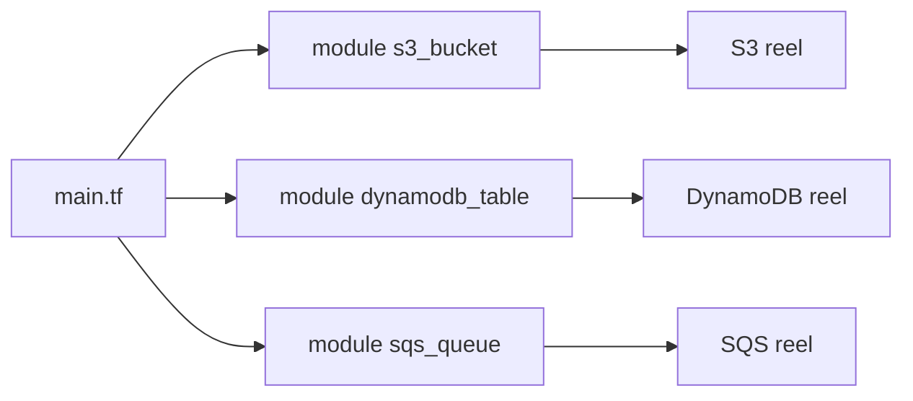

<a id="top"></a>

# Chapitre 4 — Pratique : refactor en modules Terraform

> **Module :** M4.
>
> **Théorie associée :** [`04a-Chapitre4-Theorie-modules-terraform.md`](04a-Chapitre4-Theorie-modules-terraform.md)
>
> **Solution exécutable :** [`solutions/tp4b/`](solutions/tp4b/)
>
> **Durée estimée :** 90 minutes.

---

> **ARGENT :** mêmes ressources que TP 3 (Free Tier). **`terraform destroy` à la fin.**

---

## Sommaire

- [Objectifs](#objectifs)
- [Architecture cible](#archi)
- [Plan du TP (parties I à XIII)](#plan)
- [Partie I — Repartir du TP 3](#part1)
- [Partie II — Squelette `modules/`](#part2)
- [Partie III — Module `s3_bucket`](#part3)
- [Partie IV — Module `dynamodb_table`](#part4)
- [Partie V — Module `sqs_queue`](#part5)
- [Partie VI — Réécrire `main.tf` racine](#part6)
- [Partie VII — Outputs racine](#part7)
- [Partie VIII — `init` (avec modules locaux)](#part8)
- [Partie IX — `apply` et validations](#part9)
- [Partie X — Réutilisation : créer un second bucket en une ligne](#part10)
- [Partie XI — Tester via Streamlit](#part11)
- [Partie XII — Mini-rapport](#part12)
- [Partie XIII — Nettoyage](#part13)
- [Barème](#bareme)
- [Corrigé minimal](#corrige)
- [Références](#references)

---

<a id="objectifs"></a>

## Objectifs

- séparer le code en **3 modules locaux** réutilisables,
- comprendre la différence entre **inputs** (variables) et **outputs** d'un module,
- réutiliser un module pour créer **un second bucket** en une seule ligne.

---

<a id="archi"></a>

## Architecture cible



---

<a id="plan"></a>

## Plan du TP (parties I à XIII)

| Partie | Sujet |
|---:|---|
| I | base TP 3 |
| II | squelette modules |
| III | module s3_bucket |
| IV | module dynamodb_table |
| V | module sqs_queue |
| VI | main.tf racine |
| VII | outputs racine |
| VIII | init |
| IX | apply + validations |
| X | réutilisation |
| XI | UI |
| XII | mini-rapport |
| XIII | destroy |

---

<a id="part1"></a>

## Partie I — Repartir du TP 3

```bash
cd terraform-aws-free-tier/solutions/tp4b
cp .env.example .env
```

---

<a id="part2"></a>

## Partie II — Squelette `modules/`

```text
terraform/modules/
├── s3_bucket/
│   ├── main.tf
│   ├── variables.tf
│   └── outputs.tf
├── dynamodb_table/
│   ├── main.tf
│   ├── variables.tf
│   └── outputs.tf
└── sqs_queue/
    ├── main.tf
    ├── variables.tf
    └── outputs.tf
```

---

<a id="part3"></a>

## Partie III — Module `s3_bucket`

`modules/s3_bucket/variables.tf` :

```hcl
variable "bucket_name"         { type = string }
variable "versioning_enabled"  { type = bool, default = true }
variable "block_public_access" { type = bool, default = true }
variable "sse_algorithm"       { type = string, default = "AES256" }
variable "tags"                { type = map(string), default = {} }
```

`modules/s3_bucket/main.tf` :

```hcl
resource "aws_s3_bucket" "this" {
  bucket = var.bucket_name
  tags   = var.tags
}

resource "aws_s3_bucket_versioning" "this" {
  bucket = aws_s3_bucket.this.id
  versioning_configuration {
    status = var.versioning_enabled ? "Enabled" : "Suspended"
  }
}

resource "aws_s3_bucket_public_access_block" "this" {
  count                   = var.block_public_access ? 1 : 0
  bucket                  = aws_s3_bucket.this.id
  block_public_acls       = true
  block_public_policy     = true
  ignore_public_acls      = true
  restrict_public_buckets = true
}

resource "aws_s3_bucket_server_side_encryption_configuration" "this" {
  bucket = aws_s3_bucket.this.id
  rule {
    apply_server_side_encryption_by_default { sse_algorithm = var.sse_algorithm }
  }
}
```

`modules/s3_bucket/outputs.tf` :

```hcl
output "bucket_id"  { value = aws_s3_bucket.this.id }
output "bucket_arn" { value = aws_s3_bucket.this.arn }
```

> **Astuce :** `count` conditionnel pour rendre le **public access block** optionnel.

---

<a id="part4"></a>

## Partie IV — Module `dynamodb_table`

Inputs : `table_name`, `hash_key`, `hash_key_type`, `billing_mode`, `tags`.

```hcl
resource "aws_dynamodb_table" "this" {
  name         = var.table_name
  billing_mode = var.billing_mode
  hash_key     = var.hash_key

  attribute {
    name = var.hash_key
    type = var.hash_key_type
  }

  tags = var.tags
}
```

---

<a id="part5"></a>

## Partie V — Module `sqs_queue`

Inputs : `queue_name`, `visibility_timeout_seconds`, `message_retention_seconds`, `receive_wait_time_seconds`, `sse_enabled`, `tags`.

```hcl
resource "aws_sqs_queue" "this" {
  name                       = var.queue_name
  visibility_timeout_seconds = var.visibility_timeout_seconds
  message_retention_seconds  = var.message_retention_seconds
  receive_wait_time_seconds  = var.receive_wait_time_seconds
  sqs_managed_sse_enabled    = var.sse_enabled
  tags                       = var.tags
}
```

---

<a id="part6"></a>

## Partie VI — Réécrire `main.tf` racine

```hcl
locals {
  common_tags = {
    Project     = "tp4"
    Environment = var.environment
    Owner       = var.owner
    ManagedBy   = "terraform"
  }
}

resource "random_id" "suffix" { byte_length = 3 }

module "data_bucket" {
  source      = "./modules/s3_bucket"
  bucket_name = "${var.project_prefix}-tp4-data-${random_id.suffix.hex}"
  tags        = merge(local.common_tags, { Purpose = "data" })
}

module "items_table" {
  source     = "./modules/dynamodb_table"
  table_name = "${var.project_prefix}-tp4-items"
  hash_key   = "pk"
  tags       = merge(local.common_tags, { Purpose = "items" })
}

module "events_queue" {
  source     = "./modules/sqs_queue"
  queue_name = "${var.project_prefix}-tp4-events"
  tags       = merge(local.common_tags, { Purpose = "events" })
}
```

Le `main.tf` est devenu un **schéma d'architecture lisible**.

---

<a id="part7"></a>

## Partie VII — Outputs racine

```hcl
output "data_bucket_name"  { value = module.data_bucket.bucket_id }
output "items_table_name"  { value = module.items_table.table_name }
output "events_queue_url"  { value = module.events_queue.queue_url }
```

---

<a id="part8"></a>

## Partie VIII — `init` (avec modules locaux)

```bash
docker compose run --rm tools terraform -chdir=terraform init
```

> **Astuce :** Terraform détecte les modules locaux automatiquement via `source = "./modules/..."`. Pas besoin de `terraform get` séparé.

---

<a id="part9"></a>

## Partie IX — `apply` et validations

```bash
docker compose run --rm tools terraform -chdir=terraform apply -auto-approve
docker compose run --rm tools terraform -chdir=terraform state list
```

Vous devriez voir des ressources préfixées par `module.<nom>.` :

```
module.data_bucket.aws_s3_bucket.this
module.data_bucket.aws_s3_bucket_versioning.this
...
module.items_table.aws_dynamodb_table.this
module.events_queue.aws_sqs_queue.this
```

---

<a id="part10"></a>

## Partie X — Réutilisation : créer un second bucket en une ligne

Modifier `main.tf` (en mode démo, pas dans le state final) :

```hcl
resource "random_id" "suffix_logs" { byte_length = 3 }

module "logs_bucket" {
  source      = "./modules/s3_bucket"
  bucket_name = "${var.project_prefix}-tp4-logs-${random_id.suffix_logs.hex}"
  tags        = merge(local.common_tags, { Purpose = "logs" })
}
```

`terraform apply` : un second bucket apparaît, avec les **mêmes garanties** (versioning, public access block, SSE). **8 lignes pour un bucket conforme.**

> **Astuce :** détruisez ce second bucket avant de continuer si vous voulez conserver une infra TP 4 minimale.

---

<a id="part11"></a>

## Partie XI — Tester via Streamlit

Identique au TP 3 : `docker compose up -d streamlit`, ouvrir http://localhost:8501.

---

<a id="part12"></a>

## Partie XII — Mini-rapport

1. Quels fichiers minimaux un module doit-il avoir ?
2. Comment référence-t-on un module local ?
3. Pourquoi ne pas déclarer le `provider` dans le module ?
4. Comment réutiliser le même module pour créer 2 buckets différents ?
5. Quel est le bénéfice principal de la modularisation ?

---

<a id="part13"></a>

## Partie XIII — Nettoyage

```bash
docker compose run --rm tools terraform -chdir=terraform destroy -auto-approve
docker compose down
```

---

<a id="bareme"></a>

## Barème (40 points)

| Partie | Points |
|---:|---:|
| I | 1 |
| II — squelette | 3 |
| III — module S3 | 8 |
| IV — module DDB | 5 |
| V — module SQS | 5 |
| VI — main racine | 6 |
| VII — outputs | 3 |
| VIII — init | 1 |
| IX — apply | 3 |
| X — réutilisation | 3 |
| XII — mini-rapport | 2 |
| **Total** | **40** |

---

<a id="corrige"></a>

## Corrigé minimal

Voir [`solutions/tp4b/`](solutions/tp4b/).

---

<a id="references"></a>

## Références

- HashiCorp — Modules : https://developer.hashicorp.com/terraform/language/modules
- HashiCorp — Module composition : https://developer.hashicorp.com/terraform/language/modules/develop/composition

---

⬅ [`04a-...md`](04a-Chapitre4-Theorie-modules-terraform.md) | 🏠 [`README.md`](README.md) | ➡ [`05a-...md`](05a-Chapitre5-Theorie-multi-environnements.md)

<p align="right"><a href="#top">↑ Retour en haut</a></p>
