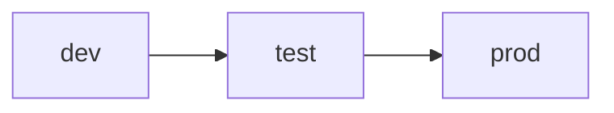
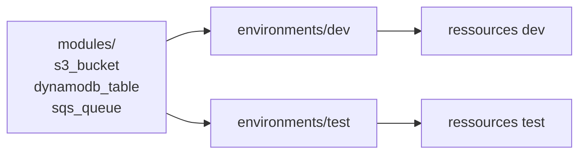

# Chapitre 5 — Théorie : multi-environnements `dev` / `test`

> **Objectif :** comprendre les stratégies pour gérer plusieurs environnements (dev, test, prod) avec Terraform et choisir celle de ce cours.

---

## Sommaire

1. [Pourquoi des environnements séparés ?](#pourquoi)
2. [Trois stratégies courantes](#strategies)
3. [Stratégie retenue : un dossier par environnement](#choix)
4. [Anatomie du TP 5](#anatomie)
5. [Variables et `.tfvars`](#tfvars)
6. [Risques et bonnes pratiques](#risques)
7. [Quiz](#quiz)
8. [Références](#references)

---

<a id="pourquoi"></a>

## 1. Pourquoi des environnements séparés ?

| Sans séparation | Avec dev / test |
|---|---|
| une modif casse tout | dev sert de bac à sable |
| pas de tests d'intégration | test reproduit prod |
| pas de retour arrière | promotion contrôlée dev → test → prod |



Dans ce cours, on s'arrête à `dev` et `test`. La logique est la même pour `prod`.

---

<a id="strategies"></a>

## 2. Trois stratégies courantes

| Stratégie | Idée | Pour | Contre |
|---|---|---|---|
| **Workspaces** | un même code, plusieurs states (`terraform workspace`) | rapide à mettre en place | partage involontaire de code, dangereux pour prod |
| **Un dossier par env** | `environments/dev/`, `environments/test/`, modules partagés | **clair**, isolation forte | un peu plus de fichiers |
| **Terragrunt** | wrapper qui factorise | très DRY | dépendance externe |

> **Choix du cours :** **un dossier par environnement**, qui est la pratique la plus courante en équipe et qui est très lisible.

---

<a id="choix"></a>

## 3. Stratégie retenue : un dossier par environnement

```text
solutions/tp5b/terraform/
├── modules/
│   ├── s3_bucket/
│   ├── dynamodb_table/
│   └── sqs_queue/
└── environments/
    ├── dev/
    │   ├── main.tf
    │   ├── variables.tf
    │   ├── outputs.tf
    │   ├── provider.tf
    │   └── terraform.tfvars
    └── test/
        ├── main.tf
        ├── variables.tf
        ├── outputs.tf
        ├── provider.tf
        └── terraform.tfvars
```

Chaque environnement a **son propre state**, ses propres ressources, mais utilise les **mêmes modules** dans `modules/`.

---

<a id="anatomie"></a>

## 4. Anatomie du TP 5



Convention : on suffixe toutes les ressources par `-<env>` (ex. `tfaws-alice-data-dev`, `tfaws-alice-data-test`).

---

<a id="tfvars"></a>

## 5. Variables et `.tfvars`

Le fichier `terraform.tfvars` (ou `dev.tfvars` / `test.tfvars`) contient les **valeurs concrètes** des variables. Il est lu automatiquement par Terraform.

`environments/dev/terraform.tfvars` :

```hcl
environment    = "dev"
project_prefix = "tfaws-alice"
region         = "us-east-1"
```

`environments/test/terraform.tfvars` :

```hcl
environment    = "test"
project_prefix = "tfaws-alice"
region         = "us-east-1"
```

> **Astuce :** ne mettez jamais de **secret** dans un `.tfvars` committé. Pour les secrets, utilisez `TF_VAR_xxx` en variable d'environnement ou un secret manager.

---

<a id="risques"></a>

## 6. Risques et bonnes pratiques

| Risque | Mitigation |
|---|---|
| Confondre dev et prod | Toujours `cd environments/<env>` avant `apply` |
| Détruire prod par erreur | State séparé, MFA sur prod, alarmes |
| Drift entre envs | Promotion contrôlée, tests automatisés |
| Coût qui dérive | Tags `Environment` partout + Budget Alerts par tag |

---

<a id="quiz"></a>

## 7. Quiz

1. Citer **trois stratégies** pour gérer plusieurs environnements.
2. Pourquoi un état par environnement est-il préférable ?
3. Quelle convention de nommage utilise-t-on dans ce cours ?
4. Que **ne pas mettre** dans un `.tfvars` ?
5. Quel tag est obligatoire au TP 5 ?

> Réponses : 1. Workspaces, dossier par env, Terragrunt. 2. Isolation, pas de partage involontaire. 3. Suffixe `-<env>`. 4. Secrets. 5. `Environment`.

---

<a id="references"></a>

## 8. Références

- HashiCorp — Workspaces : https://developer.hashicorp.com/terraform/language/state/workspaces
- HashiCorp — Style guide : https://developer.hashicorp.com/terraform/language/style
- Gruntwork — Terraform module patterns : https://www.gruntwork.io/blog

---

⬅ TP précédent : [`04b-Chapitre4-Pratique-modules-terraform.md`](04b-Chapitre4-Pratique-modules-terraform.md)  
➡ Pratique : [`05b-Chapitre5-Pratique-environnements-dev-test.md`](05b-Chapitre5-Pratique-environnements-dev-test.md)
