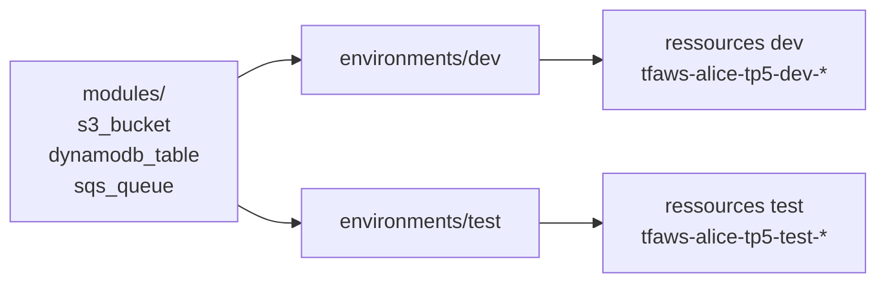

<a id="top"></a>

# Chapitre 5 — Pratique : multi-environnements `dev` / `test`

> **Module :** M5.
>
> **Théorie associée :** [`05a-Chapitre5-Theorie-multi-environnements.md`](05a-Chapitre5-Theorie-multi-environnements.md)
>
> **Solution exécutable :** [`solutions/tp5b/`](solutions/tp5b/)
>
> **Durée estimée :** 90 minutes.

---

> **ARGENT :** vous déployez **deux fois** les mêmes ressources (dev + test). Free Tier OK, mais **`terraform destroy` sur chacun** des deux environnements à la fin.

---

## Sommaire

- [Objectifs](#objectifs)
- [Architecture cible](#archi)
- [Plan du TP (parties I à XV)](#plan)
- [Partie I — Repartir du TP 4](#part1)
- [Partie II — Réorganiser `terraform/`](#part2)
- [Partie III — `environments/dev/` complet](#part3)
- [Partie IV — `terraform.tfvars` dev](#part4)
- [Partie V — Cloner `dev` → `test`](#part5)
- [Partie VI — `terraform.tfvars` test](#part6)
- [Partie VII — `init` et `apply` sur `dev`](#part7)
- [Partie VIII — `init` et `apply` sur `test`](#part8)
- [Partie IX — Vérifier que les deux states sont **distincts**](#part9)
- [Partie X — Streamlit avec `TF_ENVIRONMENT`](#part10)
- [Partie XI — Diff entre les deux environnements](#part11)
- [Partie XII — Mini-rapport](#part12)
- [Partie XIII — Détruire les deux environnements](#part13)
- [Partie XIV — Vérifier la facturation](#part14)
- [Partie XV — Pour aller plus loin](#part15)
- [Barème](#bareme)
- [Corrigé minimal](#corrige)
- [Références](#references)

---

<a id="objectifs"></a>

## Objectifs

- isoler `dev` et `test` dans des dossiers séparés avec un **state propre**,
- réutiliser les modules du TP 4 sans les dupliquer,
- piloter chaque environnement avec son propre `terraform.tfvars`,
- pointer Streamlit sur l'un ou l'autre via une variable d'environnement.

---

<a id="archi"></a>

## Architecture cible



---

<a id="plan"></a>

## Plan du TP (parties I à XV)

| Partie | Sujet |
|---:|---|
| I | base TP 4 |
| II | réorganiser dossiers |
| III | environnement dev |
| IV | tfvars dev |
| V | clone dev → test |
| VI | tfvars test |
| VII | apply dev |
| VIII | apply test |
| IX | states distincts |
| X | Streamlit param |
| XI | diff |
| XII | mini-rapport |
| XIII | destroy x2 |
| XIV | facturation |
| XV | aller plus loin |

---

<a id="part1"></a>

## Partie I — Repartir du TP 4

```bash
cd terraform-aws-free-tier/solutions/tp5b
cp .env.example .env
```

Le dossier `solutions/tp5b/terraform/modules/` est **identique** à celui du TP 4.

---

<a id="part2"></a>

## Partie II — Réorganiser `terraform/`

```text
terraform/
├── modules/
│   ├── s3_bucket/
│   ├── dynamodb_table/
│   └── sqs_queue/
└── environments/
    ├── dev/
    └── test/
```

---

<a id="part3"></a>

## Partie III — `environments/dev/` complet

`environments/dev/main.tf` :

```hcl
locals {
  common_tags = {
    Project     = "tp5"
    Environment = var.environment
    Owner       = var.owner
    ManagedBy   = "terraform"
  }
}

resource "random_id" "suffix" { byte_length = 3 }

module "data_bucket" {
  source      = "../../modules/s3_bucket"
  bucket_name = "${var.project_prefix}-tp5-${var.environment}-data-${random_id.suffix.hex}"
  tags        = merge(local.common_tags, { Purpose = "data" })
}

module "items_table" {
  source     = "../../modules/dynamodb_table"
  table_name = "${var.project_prefix}-tp5-${var.environment}-items"
  hash_key   = "pk"
  tags       = merge(local.common_tags, { Purpose = "items" })
}

module "events_queue" {
  source     = "../../modules/sqs_queue"
  queue_name = "${var.project_prefix}-tp5-${var.environment}-events"
  tags       = merge(local.common_tags, { Purpose = "events" })
}
```

> **Astuce :** notez `source = "../../modules/s3_bucket"`. Les modules sont **partagés** entre les environnements.

---

<a id="part4"></a>

## Partie IV — `terraform.tfvars` dev

`environments/dev/terraform.tfvars` :

```hcl
environment = "dev"
region      = "us-east-1"
```

> **Pourquoi ?** Terraform lit automatiquement `terraform.tfvars` et y applique les valeurs.

---

<a id="part5"></a>

## Partie V — Cloner `dev` → `test`

`environments/test/main.tf`, `variables.tf`, `provider.tf`, `outputs.tf` sont **strictement identiques** à dev.

> **Astuce :** vous pourriez factoriser encore plus (un seul `main.tf` dans un dossier `shared`), mais cela cache le contenu à l'utilisateur. Le copier-coller minimal reste lisible.

---

<a id="part6"></a>

## Partie VI — `terraform.tfvars` test

`environments/test/terraform.tfvars` :

```hcl
environment = "test"
region      = "us-east-1"
```

---

<a id="part7"></a>

## Partie VII — `init` et `apply` sur `dev`

```bash
docker compose run --rm tools terraform -chdir=terraform/environments/dev init
docker compose run --rm tools terraform -chdir=terraform/environments/dev plan
docker compose run --rm tools terraform -chdir=terraform/environments/dev apply -auto-approve
```

---

<a id="part8"></a>

## Partie VIII — `init` et `apply` sur `test`

```bash
docker compose run --rm tools terraform -chdir=terraform/environments/test init
docker compose run --rm tools terraform -chdir=terraform/environments/test plan
docker compose run --rm tools terraform -chdir=terraform/environments/test apply -auto-approve
```

---

<a id="part9"></a>

## Partie IX — Vérifier que les deux states sont distincts

```bash
docker compose run --rm tools bash -lc 'ls -la terraform/environments/dev/terraform.tfstate*  terraform/environments/test/terraform.tfstate*'
docker compose run --rm tools terraform -chdir=terraform/environments/dev  state list
docker compose run --rm tools terraform -chdir=terraform/environments/test state list
```

> Chaque environnement a **son propre fichier `terraform.tfstate`** dans son dossier. Pas de partage.

---

<a id="part10"></a>

## Partie X — Streamlit avec `TF_ENVIRONMENT`

Pour pointer l'UI sur **dev** (défaut) :

```bash
docker compose up -d streamlit
```

Pour pointer sur **test** :

```bash
TF_ENVIRONMENT=test docker compose up -d --force-recreate streamlit
```

Sur Windows PowerShell :

```powershell
$env:TF_ENVIRONMENT="test"; docker compose up -d --force-recreate streamlit
```

---

<a id="part11"></a>

## Partie XI — Diff entre les deux environnements

```bash
docker compose run --rm tools aws s3 ls | grep tp5
docker compose run --rm tools aws dynamodb list-tables | grep tp5
docker compose run --rm tools aws sqs list-queues | grep tp5
```

Vous devez voir :

- `tfaws-alice-tp5-dev-*`
- `tfaws-alice-tp5-test-*`

soit **6 ressources au total** (3 par environnement).

---

<a id="part12"></a>

## Partie XII — Mini-rapport

1. Combien de fichiers `terraform.tfstate` y a-t-il après TP 5 ?
2. Pourquoi factoriser les modules dans `modules/` ?
3. Que fait Terraform lorsqu'il trouve `terraform.tfvars` ?
4. Pourquoi le tag `Environment` est-il critique ?
5. Si vous oubliez `destroy` sur `test`, qu'est-ce qui reste payant à terme ?

---

<a id="part13"></a>

## Partie XIII — Détruire les deux environnements

> **Attention :** `destroy` se fait **par environnement**. N'oubliez ni dev ni test.

```bash
docker compose run --rm tools terraform -chdir=terraform/environments/dev  destroy -auto-approve
docker compose run --rm tools terraform -chdir=terraform/environments/test destroy -auto-approve
```

Vérifier dans la console :

- S3 → aucun bucket `tfaws-*-tp5-*`.
- DynamoDB → aucune table `tfaws-*-tp5-*`.
- SQS → aucune queue `tfaws-*-tp5-*`.

```bash
docker compose down
```

---

<a id="part14"></a>

## Partie XIV — Vérifier la facturation

Console → Billing → Cost Explorer → grouper par tag `Project` → la ligne `tp5` doit retomber à 0 USD dans les heures qui suivent.

---

<a id="part15"></a>

## Partie XV — Pour aller plus loin

- Ajouter un environnement `prod` (mêmes ressources, plus de tags, MFA exigé sur le user).
- Configurer un **backend S3 + DynamoDB lock** pour les states (en production).
- Mettre en place un **workflow Git** où chaque environnement a sa branche.
- Ajouter un **fichier `backend.tf` distinct** par environnement.

---

<a id="bareme"></a>

## Barème (50 points)

| Partie | Points |
|---:|---:|
| I — base | 1 |
| II — réorganisation | 3 |
| III — env dev | 6 |
| IV — tfvars dev | 2 |
| V — clone | 3 |
| VI — tfvars test | 2 |
| VII — apply dev | 5 |
| VIII — apply test | 5 |
| IX — states distincts | 5 |
| X — UI param | 4 |
| XI — diff | 4 |
| XII — mini-rapport | 3 |
| XIII — destroy x2 | 5 |
| XIV — facturation | 2 |
| **Total** | **50** |

---

<a id="corrige"></a>

## Corrigé minimal

Voir [`solutions/tp5b/`](solutions/tp5b/).

---

<a id="references"></a>

## Références

- HashiCorp — Workspaces vs directories : https://developer.hashicorp.com/terraform/language/state/workspaces
- HashiCorp — Variable definition files : https://developer.hashicorp.com/terraform/language/values/variables#variable-definitions-tfvars-files
- HashiCorp — Backend `s3` : https://developer.hashicorp.com/terraform/language/backend/s3

---

⬅ [`05a-...md`](05a-Chapitre5-Theorie-multi-environnements.md) | 🏠 [`README.md`](README.md)

<p align="right"><a href="#top">↑ Retour en haut</a></p>
