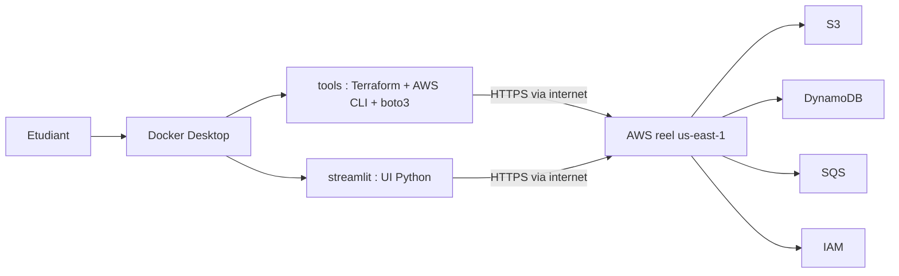
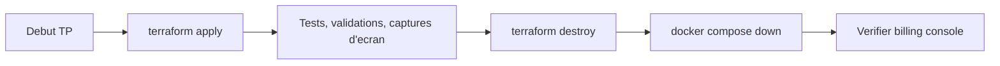
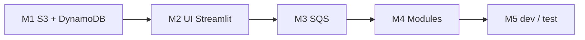

<a id="top"></a>

# Cours — Terraform sur un vrai compte AWS (Free Tier)

> **Public visé :** étudiants déjà familiers avec LocalStack (cours `terraform-with-localstack`) qui veulent maintenant **déployer pour de vrai** sur AWS, sans dépasser le Free Tier.
>
> **Niveau :** Débutant à intermédiaire.
>
> **Durée totale estimée :** ~22 à 28 heures (5 TPs).
>
> **Méthode unique :** Docker Compose + `Dockerfile.tools` (Terraform et AWS CLI dans un conteneur) + `Dockerfile.streamlit` à partir du TP 2. Seul Docker Desktop est requis sur la machine étudiante.
>
> **Langue du cours :** français.

---

> **ATTENTION ARGENT RÉEL :** Tout dans ce cours déploie sur **votre vrai compte AWS**. Une mauvaise manipulation (oublier `terraform destroy`, choisir un type de ressource hors Free Tier, créer trop de buckets, lancer un Lambda en boucle) peut **engendrer des coûts**. Lisez [`00-theorie-terraform-aws-free-tier.md`](00-theorie-terraform-aws-free-tier.md) **en entier** avant le premier TP.

---

## Sommaire

1. [À qui ce cours s'adresse](#a-qui)
2. [Ce que vous saurez faire à la fin](#objectifs)
3. [Architecture pédagogique](#architecture)
4. [Prérequis](#prerequis)
5. [Compte AWS et IAM user dédié](#compte-aws)
6. [Free Tier : ce qui est gratuit, ce qui ne l'est pas](#free-tier)
7. [Discipline de coût](#discipline)
8. [Structure des fichiers du cours](#structure)
9. [Plan du cours — 5 TPs](#plan)
10. [Conventions du cours](#conventions)
11. [Dépannage rapide](#depannage)
12. [Cheat sheet — commandes utiles](#cheatsheet)
13. [Références utiles](#references)

---

<a id="a-qui"></a>

## 1. À qui ce cours s'adresse

Ce cours s'adresse à toute personne qui a déjà fait le cours `terraform-with-localstack` (ou qui maîtrise les bases Terraform) et veut maintenant **déployer sur de vrais services AWS**.

Ce que vous gagnez par rapport à LocalStack :

- vrai **enforcement IAM** (les `Deny` bloquent vraiment),
- vrai **filtrage Security Groups / NACL**,
- vrais **services managés** (Secrets Manager, Lambda en production, CloudWatch complet),
- **vraie persistance** au-delà du conteneur,
- **vrais artefacts** que l'on peut montrer à un employeur.

Ce que vous perdez :

- la possibilité de tout casser sans facture,
- la liberté de tester GuardDuty, AWS Config, Security Hub… (services payants).

---

<a id="objectifs"></a>

## 2. Ce que vous saurez faire à la fin

- Créer un **IAM user dédié au développement Terraform**, avec une clé d'accès, **sans utiliser le compte root**.
- Configurer AWS CLI à l'intérieur d'un conteneur Docker (aucun outil installé sur la machine hôte).
- Provisionner via **Terraform** : S3, DynamoDB, SQS, IAM, Lambda (les ressources Free Tier).
- Construire une **UI Streamlit** locale qui parle aux services AWS via `boto3`.
- **Modulariser** votre code Terraform en modules réutilisables.
- Déployer en **multi-environnements** (`dev` / `test`) avec des fichiers `.tfvars`.
- **Détruire** systématiquement les ressources pour rester dans le Free Tier.
- Garder une **discipline de coût** : tags, alertes de budget, `terraform destroy` en fin de session.

---

<a id="architecture"></a>

## 3. Architecture pédagogique



**Logique générale :**

- Vous n'installez **rien d'autre que Docker Desktop** sur la machine.
- Le conteneur `tools` contient Terraform, AWS CLI et `boto3`.
- Le conteneur `streamlit` (à partir du TP 2) lance l'UI Python.
- Les **clés AWS** sont lues depuis `.env` et injectées dans les conteneurs.
- **Aucun appel à LocalStack.** Les conteneurs parlent directement aux APIs AWS publiques en HTTPS.

---

<a id="prerequis"></a>

## 4. Prérequis

| Outil | Vérification |
|---|---|
| **Docker Desktop** | `docker --version` et `docker compose version` |
| **VS Code (recommandé)** | éditeur de fichiers `.tf` et `.py` |
| **Connaissance Terraform** | équivalent au cours `terraform-with-localstack` (au moins TP 1) |

Aucun autre outil (Terraform, AWS CLI, Python) n'est requis sur la machine hôte — tout est fourni par les conteneurs.

---

<a id="compte-aws"></a>

## 5. Compte AWS et IAM user dédié

### 5.1. Créer un compte AWS

- https://aws.amazon.com/ → « Create an AWS Account ».
- Carte bancaire requise pour la validation. La **plupart des ressources de ce cours sont dans le Free Tier**.
- Activer la **MFA sur le compte root** immédiatement après la création.
- **Ne plus se connecter en root sauf en cas de force majeure.**

### 5.2. Créer un IAM user dédié `terraform-student`

1. Console AWS → **IAM** → **Users** → **Create user**.
2. Nom : `terraform-student`.
3. **Provide user access to the AWS Management Console** : non, on n'a pas besoin d'accès console pour ce user.
4. **Permissions options** → **Attach policies directly** → cocher temporairement **`AdministratorAccess`** (pour le cours uniquement).
5. Créer le user.
6. Sélectionner le user → **Security credentials** → **Create access key** → **Application running outside AWS** → noter `Access key ID` et `Secret access key`.

> **Bonne pratique réelle :** en entreprise, vous n'utiliseriez **pas** `AdministratorAccess`, mais des permissions fines (S3, DynamoDB, SQS, IAM limited). Pour ce cours pédagogique, `AdministratorAccess` simplifie. Le TP 4 montrera comment restreindre.

### 5.3. Activer une alerte de budget

1. Console AWS → **Billing** → **Budgets** → **Create budget**.
2. Choisir **Cost budget**, par exemple **5 USD / mois** avec une alerte par email à **80 %**.
3. Cela vous prévient si vous dépassez accidentellement le Free Tier.

> **Pourquoi ?** Le Free Tier n'est pas illimité. Un bucket avec beaucoup d'objets, une table DynamoDB mal provisionnée ou un Lambda en boucle peuvent générer quelques dollars vite fait. L'alerte de budget vous prévient avant que la facture ne grossisse.

---

<a id="free-tier"></a>

## 6. Free Tier : ce qui est gratuit, ce qui ne l'est pas

> **Source officielle :** https://aws.amazon.com/free/

| Service | Free Tier (12 mois ou toujours gratuit) | Utilisé dans ce cours |
|---|---|---|
| **S3** | 5 Go standard, 20 000 GET, 2 000 PUT / mois (12 mois) | TPs 1-5 |
| **DynamoDB** | 25 Go stockage, 25 unités RCU/WCU On-Demand (toujours gratuit) | TPs 1-5 |
| **SQS** | 1 000 000 requêtes / mois (toujours gratuit) | TPs 3-5 |
| **Lambda** | 1 000 000 requêtes + 400 000 GB-seconds / mois (toujours gratuit) | Non utilisé ici |
| **CloudWatch Logs** | 5 Go ingestion + 5 Go stockage (toujours gratuit) | Mentionné |
| **IAM** | gratuit | TPs 1-5 |
| **VPC** | gratuit (sauf NAT Gateway, EIP non attachée) | Hors cours |
| **EC2** | 750 h `t2.micro`/`t3.micro` / mois (12 mois) | **Hors cours** |
| **RDS** | 750 h `db.t2.micro` (12 mois) | **Hors cours** |

> **Hors Free Tier — à NE PAS faire dans ce cours :**
>
> - NAT Gateway (~0.045 USD/h),
> - Elastic IP non attachée (~0.005 USD/h),
> - VPC endpoint Interface (~0.01 USD/h),
> - DynamoDB Provisioned mode avec capacité trop haute,
> - RDS hors `t2.micro` Free Tier,
> - tout ce que vous n'avez pas vérifié dans le tableau Free Tier.

---

<a id="discipline"></a>

## 7. Discipline de coût

Quatre règles d'or :

1. **`terraform destroy` à la fin de chaque session.**
2. **Tagger toutes les ressources** : `Project = "tpN"`, `Environment = "dev"`, `Owner = "<prenom>"`.
3. **Alerte de budget** activée à 5 USD avec email.
4. **Vérifier la console** AWS Billing → Cost Explorer en fin de semaine.



---

<a id="structure"></a>

## 8. Structure des fichiers du cours

```text
terraform-aws-free-tier/
├── README.md                                       (ce fichier)
│
├── 00-theorie-terraform-aws-free-tier.md           théorie + IAM + Free Tier + coûts
│
├── 01a-Chapitre1-Theorie-premier-projet-terraform.md       M1 théorie
├── 01b-Chapitre1-Pratique-premier-projet-terraform-s3-dynamodb.md  M1 TP
│
├── 02a-Chapitre2-Theorie-streamlit-validation.md           M2 théorie
├── 02b-Chapitre2-Pratique-ajout-ui-streamlit.md            M2 TP
│
├── 03a-Chapitre3-Theorie-sqs.md                            M3 théorie
├── 03b-Chapitre3-Pratique-ajouter-sqs.md                   M3 TP
│
├── 04a-Chapitre4-Theorie-modules-terraform.md              M4 théorie
├── 04b-Chapitre4-Pratique-modules-terraform.md             M4 TP
│
├── 05a-Chapitre5-Theorie-multi-environnements.md           M5 théorie
├── 05b-Chapitre5-Pratique-environnements-dev-test.md       M5 TP
│
└── solutions/                                       projets exécutables
    ├── README.md
    ├── tp1b/   S3 + DynamoDB
    ├── tp2b/   + Streamlit UI
    ├── tp3b/   + SQS
    ├── tp4b/   refactor en modules
    └── tp5b/   multi-environnements dev/test
```

---

<a id="plan"></a>

## 9. Plan du cours — 5 TPs

| # | Module | Type | Document(s) | Lab |
|---:|---|---|---|---|
| 1 | Premier projet Terraform (S3 + DynamoDB) | Théorie + pratique | [`01a-...md`](01a-Chapitre1-Theorie-premier-projet-terraform.md), [`01b-...md`](01b-Chapitre1-Pratique-premier-projet-terraform-s3-dynamodb.md) | [`solutions/tp1b/`](solutions/tp1b/) |
| 2 | UI Streamlit pour valider Terraform | Théorie + pratique | [`02a-...md`](02a-Chapitre2-Theorie-streamlit-validation.md), [`02b-...md`](02b-Chapitre2-Pratique-ajout-ui-streamlit.md) | [`solutions/tp2b/`](solutions/tp2b/) |
| 3 | Ajouter SQS au projet | Théorie + pratique | [`03a-...md`](03a-Chapitre3-Theorie-sqs.md), [`03b-...md`](03b-Chapitre3-Pratique-ajouter-sqs.md) | [`solutions/tp3b/`](solutions/tp3b/) |
| 4 | Refactor en modules Terraform | Théorie + pratique | [`04a-...md`](04a-Chapitre4-Theorie-modules-terraform.md), [`04b-...md`](04b-Chapitre4-Pratique-modules-terraform.md) | [`solutions/tp4b/`](solutions/tp4b/) |
| 5 | Multi-environnements (dev / test) | Théorie + pratique | [`05a-...md`](05a-Chapitre5-Theorie-multi-environnements.md), [`05b-...md`](05b-Chapitre5-Pratique-environnements-dev-test.md) | [`solutions/tp5b/`](solutions/tp5b/) |

### Progression



---

<a id="conventions"></a>

## 10. Conventions du cours

| Élément | Valeur |
|---|---|
| Région par défaut | `us-east-1` |
| Préfixe des ressources | `tfaws-<prenom>-` (ex. `tfaws-alice-`) |
| Mode de facturation DynamoDB | **`PAY_PER_REQUEST`** (On-Demand, Free Tier) |
| Mode de capacité SQS | Standard (pas FIFO) |
| Tags obligatoires | `Project`, `Environment`, `Owner` |
| Suffixe des buckets S3 | aléatoire (les noms S3 sont globaux) |
| Chiffrement | SSE-S3 par défaut activé |

Encadrés rencontrés dans le cours :

| Encadré | Sens |
|---|---|
| `> **Objectif :** …` | But de la partie |
| `> **Astuce :** …` | Bon réflexe |
| `> **Attention :** …` | Erreur fréquente à éviter |
| `> **ARGENT :** …` | Risque de coût |
| `> **Pourquoi ?**` | Justification pédagogique |

---

<a id="depannage"></a>

## 11. Dépannage rapide

| Symptôme | Vérifier en priorité |
|---|---|
| `cannot connect to the Docker daemon` | Docker Desktop est-il démarré ? |
| `Unable to locate credentials` | `.env` contient bien `AWS_ACCESS_KEY_ID`, `AWS_SECRET_ACCESS_KEY`, `AWS_DEFAULT_REGION` ? |
| `BucketAlreadyExists` | Les noms de bucket S3 sont **globaux**, en changer le suffixe |
| `ValidationException: ... region` | `AWS_DEFAULT_REGION=us-east-1` dans `.env` |
| `AccessDenied` sur IAM | Le user `terraform-student` a-t-il les permissions ? |
| Facture surprise | Vérifier l'alerte de budget, `terraform destroy`, supprimer manuellement si besoin |

---

<a id="cheatsheet"></a>

## 12. Cheat sheet — commandes utiles

```bash
docker compose build
docker compose up -d tools                  # ou: tools streamlit

docker compose run --rm tools terraform -chdir=terraform init
docker compose run --rm tools terraform -chdir=terraform plan
docker compose run --rm tools terraform -chdir=terraform apply -auto-approve
docker compose run --rm tools terraform -chdir=terraform destroy -auto-approve

docker compose run --rm tools aws s3 ls
docker compose run --rm tools aws dynamodb list-tables
docker compose run --rm tools aws sqs list-queues
docker compose run --rm tools aws sts get-caller-identity   # qui suis-je ?

docker compose down
```

---

<a id="references"></a>

## 13. Références utiles

- AWS Free Tier : https://aws.amazon.com/free/
- AWS Budgets : https://docs.aws.amazon.com/cost-management/latest/userguide/budgets-managing-costs.html
- AWS IAM Best Practices : https://docs.aws.amazon.com/IAM/latest/UserGuide/best-practices.html
- Terraform — Provider AWS : https://registry.terraform.io/providers/hashicorp/aws/latest/docs
- Terraform — Modules : https://developer.hashicorp.com/terraform/language/modules
- AWS — Pricing Calculator : https://calculator.aws/

---

*Fin du README — bonne pratique et `terraform destroy` à chaque fin de session !*

<p align="right"><a href="#top">↑ Retour en haut</a></p>
# terraform-aws-free-tier-v1

