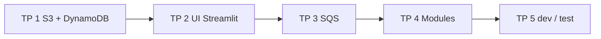

<a id="top"></a>

# Solutions — cours « Terraform sur AWS Free Tier »

Ce dossier contient **un projet autonome et exécutable** par TP. Chaque sous-dossier correspond à l'**état final attendu** du TP correspondant.

> **Méthode unique :** Docker Compose + `Dockerfile.tools` + `Dockerfile.streamlit` (à partir du TP 2). Aucun outil (Terraform, AWS CLI, Python) requis hors Docker Desktop.

> **ARGENT :** **tous** ces projets créent de **vraies ressources AWS**. Free Tier OK si vous lancez `terraform destroy` en fin de session.

---

## Sommaire des solutions

| TP | Sujet | Document pédagogique | Dossier |
|---:|---|---|---|
| 1 | Premier projet (S3 + DynamoDB) | [`../01b-...md`](../01b-Chapitre1-Pratique-premier-projet-terraform-s3-dynamodb.md) | [`tp1b/`](tp1b/) |
| 2 | UI Streamlit pour valider | [`../02b-...md`](../02b-Chapitre2-Pratique-ajout-ui-streamlit.md) | [`tp2b/`](tp2b/) |
| 3 | Ajouter SQS | [`../03b-...md`](../03b-Chapitre3-Pratique-ajouter-sqs.md) | [`tp3b/`](tp3b/) |
| 4 | Modules Terraform | [`../04b-...md`](../04b-Chapitre4-Pratique-modules-terraform.md) | [`tp4b/`](tp4b/) |
| 5 | Multi-environnements dev/test | [`../05b-...md`](../05b-Chapitre5-Pratique-environnements-dev-test.md) | [`tp5b/`](tp5b/) |

---

## Vue d'ensemble du parcours



Chaque TP **reprend** la solution précédente et ajoute une couche.

---

## Structure type d'un dossier `tpNb/`

```text
tpNb/
├── .env.example           AWS creds + region + project prefix
├── .gitignore             ignore .env, .terraform/, *.tfstate
├── docker-compose.yml     services : tools (+ streamlit a partir du TP 2)
├── Dockerfile.tools       Terraform + AWS CLI + boto3
├── Dockerfile.streamlit   Streamlit + boto3 (TP 2+)
├── lib/                   helpers boto3 (TP 2+)
├── streamlit_app/         UI (TP 2+)
├── README.md              commandes et points de validation
└── terraform/
    ├── provider.tf        provider AWS reel (region uniquement)
    ├── variables.tf
    ├── main.tf
    └── outputs.tf
```

Le **TP 4** ajoute un dossier `terraform/modules/`. Le **TP 5** ajoute aussi un dossier `terraform/environments/{dev,test}/`.

---

## Démarrage générique (vrai pour chaque `tpNb/`)

```bash
cd terraform-aws-free-tier/solutions/tpNb

cp .env.example .env
# Editer .env : AWS_ACCESS_KEY_ID, AWS_SECRET_ACCESS_KEY, PROJECT_PREFIX

docker compose build
docker compose up -d tools

docker compose run --rm tools aws sts get-caller-identity        # qui suis-je ?
docker compose run --rm tools terraform -chdir=terraform init
docker compose run --rm tools terraform -chdir=terraform plan
docker compose run --rm tools terraform -chdir=terraform apply -auto-approve

# A partir du TP 2 :
docker compose up -d streamlit   # http://localhost:8501

# Nettoyage OBLIGATOIRE :
docker compose run --rm tools terraform -chdir=terraform destroy -auto-approve
docker compose down
```

Pour le **TP 5** : remplacez `-chdir=terraform` par `-chdir=terraform/environments/<env>`.

---

## Conventions communes

| Élément | Valeur |
|---|---|
| Région par défaut | `us-east-1` |
| Préfixe ressources | `${PROJECT_PREFIX}` (ex. `tfaws-alice`) |
| Mode facturation DynamoDB | `PAY_PER_REQUEST` (Free Tier) |
| Long polling SQS | `receive_wait_time_seconds = 20` |
| Tags obligatoires | `Project`, `Environment`, `Owner`, `ManagedBy` |

---

## Vérification rapide d'un TP

```bash
cd terraform-aws-free-tier/solutions/tpNb
docker compose --env-file .env.example config --quiet && echo OK
```

Ce check valide la syntaxe du `docker-compose.yml` sans rien créer sur AWS.

---

## Avant de quitter une session

1. `terraform destroy -auto-approve` (sur chaque environnement pour le TP 5).
2. `docker compose down` (libère les ports).
3. Vérifier la **console AWS** :
   - https://s3.console.aws.amazon.com/
   - https://us-east-1.console.aws.amazon.com/dynamodbv2/
   - https://us-east-1.console.aws.amazon.com/sqs/v3/
4. Si reste : Cost Explorer + email support AWS si besoin.

<p align="right"><a href="#top">↑ Retour en haut</a></p>
